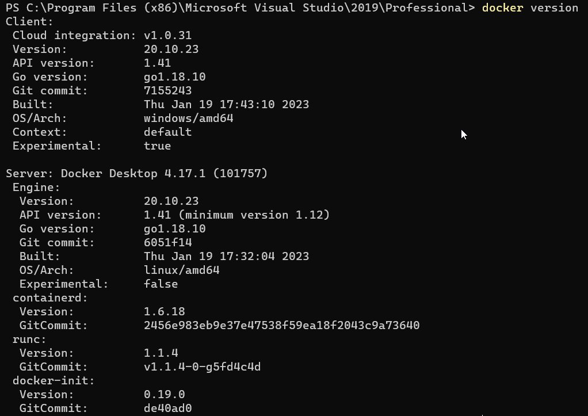
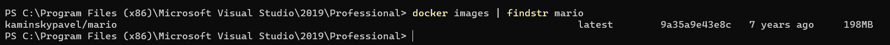

Docker games are games that can be run in Docker containers. [Docker](https://www.docker.com) is a popular tool for containerization, which allows software to be run in a portable and isolated environment. By running games in Docker containers, players can enjoy the benefits of portability, isolation, and ease of deployment. Some popular games that can be run in Docker containers include classic arcade games like Pac-Man and Donkey Kong, retro games like Super Mario Bros. and Legend of Zelda, and even modern games like Minecraft and Fortnite.

Playing games in Docker containers has several advantages. One of the main benefits is portability, which allows players to run their favorite games on any machine that supports Docker, regardless of the underlying operating system. This is especially useful for gamers who use multiple devices, as it allows them to easily switch between machines without having to install the game on each device separately. Also Docker games are easy to deploy and run, as the Docker containers include all the necessary software and dependencies, making it simple for players to get up and running quickly.

Okay, enough chit-chat - let's get right into how you can get started playing on your local machine.

## Install docker on your laptop

If you're a Linux user, I'm pretty sure you already know how to install Docker (and maybe you're already playing Docker games!). But if you're a Windows user stumbling upon this post (or maybe you're just stalking me 👀), you might not know what Docker is or how to install it. Don't worry, I've got you covered. Just follow these steps and we'll get you up and running with Docker in no time.

1. Go to the Docker [website](https://www.docker.com) and download the Docker Desktop installer for Windows.
2. Run the installer and follow the instructions to complete the installation process.
3. Once the installation is complete, open the Docker Desktop application. It may take a few minutes to start up.
4. If prompted, choose the option to use Windows containers.
5. Verify that Docker is installed correctly by opening a command prompt or PowerShell window and running the following command:

    `docker version` 

This should display the version of Docker that you have installed.

So, now that docker is install, lets look for some games shall we?

## Deploying Mario game on Docker container :

1. We will first search for mario game image from Docker registry.

    `docker search mario`

2. Next we will pull the image form the registry.

    `docker pull kaminskypavel/mario`
 
3. We can now see th docker image.

    `docker images | findstr mario`

By default, when you create a Docker container, the ports within that container are not accessible to services outside of Docker or to other Docker containers that are not connected to the same network. To make the ports within the container available to the outside world or to other containers, you can use the --publish or -p flag. This flag creates a firewall rule that maps a container port to a port on the Docker host, making the port accessible from outside the container.

`docker run -itd -p 4545:8080 kaminskpavel/mario`