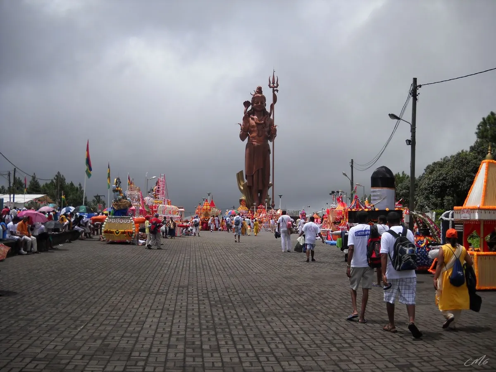
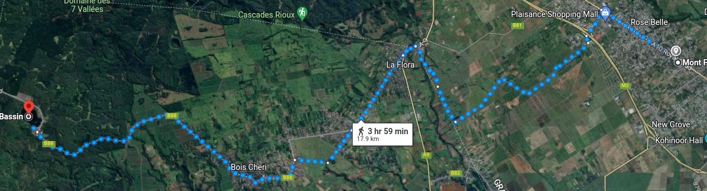
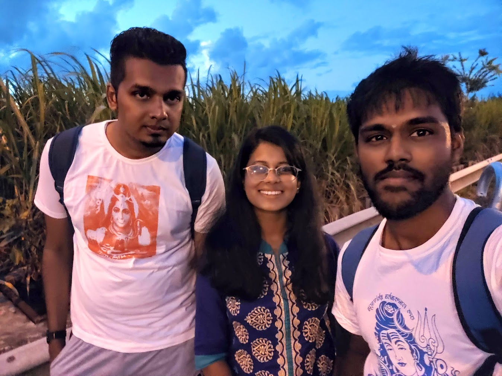
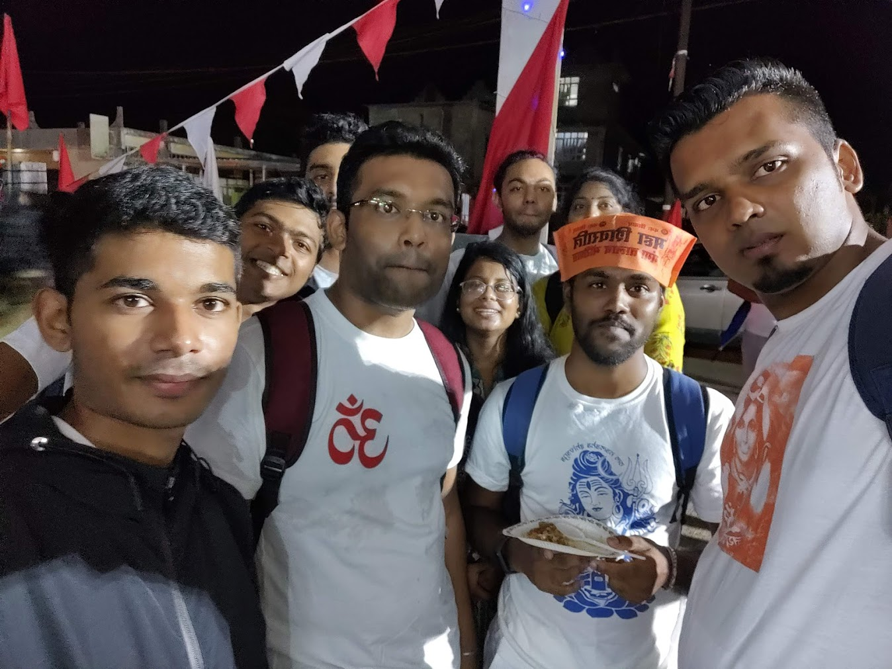
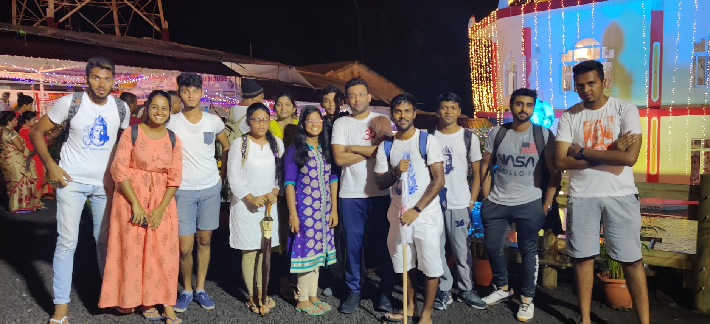

Maha Shivratri, the great night of Lord Shiva, is a festival celebrated by millions of people around the world. It is a time to honor and worship Lord Shiva, the god of destruction and transformation, and to seek his blessings for a prosperous and fulfilling life. The journey to Grand Bassin on Maha Shivratri is a unique experience that I have been fortunate enough to undertake multiple times. Due to the COVID-19 pandemic, the pilgrimage was not possible in 2021 and 2022, but with restrictions easing, I was excited to return to the road and experience the adventure once again. This year, I decided to start my walk from Rose Belle, which added an extra dimension of excitement to the journey. Although I did not take many pictures this year, I will be sharing some from my previous journey to give you a glimpse of the pilgrimage. 

Walking through the night, surrounded by the beauty of Mauritius, is a one-of-a-kind experience that I look forward to each year. The camaraderie of fellow travelers, the delicious food and drink, and the spiritual significance of the journey all contribute to an unforgettable adventure. As we made our way through the darkness, we were joined by people from all over the island who were making their way to Grand Bassin on foot. As we walked, we were sustained by the generosity of the people of Mauritius. Along the way, we were offered food and drink from temples and from people's homes. It was a heartwarming reminder of the kindness and hospitality that permeates this island nation. The food was all free of charge, provided by those who wanted to contribute to the pilgrimage and help make the journey a little easier for their fellow travelers. It was a beautiful expression of community spirit, and one of the many reasons why the Maha Shivratri pilgrimage is such a special experience. The sense of community and shared experience was palpable, and as the night wore on, our feet grew heavy, but our spirits remained high. With my backpack, comfortable sandals, and a sense of anticipation, I set out once again to see where the journey would take me.

## Preparations

Before embarking on the journey, it's important to understand the route and what to expect along the way. The pilgrimage to Grand Bassin typically starts from various locations across the island and converges at the sacred lake. For my journey, I decided to start from Rose Belle. Below is a map of the route we took, which covers a distance of approximately 20 kilometers.

The terrain is mostly hilly, with some steep inclines and declines, so it's essential to wear comfortable footwear. By preparing adequately and knowing what to expect, we were able to make the most of our pilgrimage experience. Since the journey took place at night, I made sure to bring a jacket with me as a precautionary measure against the cold weather. Temperatures can drop significantly at night, and I didn't want to risk getting sick.

## The Walk

As I live in Mahebourg, a group of my friends and I decided to take the bus from there to Rose Belle. We met up with some other friends at Rose Belle at aorund 4pm, and  we began our journey on foot. Walking through the bustling streets, we were surrounded by the festive atmosphere, as people from all over the island were making their way to Grand Bassin. 

Here's a picture of Manish, Bhavana, and me taken in 2020, just before we started our walk.

As we made our way, I caught up with a school friend of mine whom I hadn't seen in almost 15 years. It was a coincidence that we both work in the same company now, and we were both happy to reconnect after so many years. We talked about our time in school, reminisced about old times, and marveled at how much things had changed since then. We also laughed over some of our old memories. and joked along the way, and it was great to be able to share this journey with old friends.  We also talked about our friends from primary school, some of which are already married and now have children of their own, while we were still single. 

We were a large group of walkers, and as we progressed, everyone started to separate. Some were ahead, while some were way behind. However, we continued to support and encourage each other along the way. One of the most memorable aspects of the journey was the food. We stopped at various food stalls along the way, where we savored some of the most delicious street food Mauritius has to offer, such as roti, puri, briyani, and lots of juice and tea. The vendors were friendly and welcoming, and the food was freshly prepared, giving us a taste of the local cuisine.

Our group stopped to eat, and as a big fan of biryani, I couldn't resist getting myself a plate.

As the journey progressed, we started to feel the strain on our feet. The constant walking and the weight of our backpacks were taking a toll on our bodies. However, we took breaks along the way, sitting down to rest and rejuvenate. At times, we took longer breaks, and we could feel our feet struggling to get back up. But with each other's support, we managed to push through.

We continued to walk through the night, and finally, around midnight, we arrived at Grand Bassin. The sight of the sacred lake and the temple of Lord Shiva was awe-inspiring, and we felt a sense of accomplishment and fulfillment.

Here's a photo of our complete group taken in 2020 at Grand Bassin, once we had made it to our destination."

