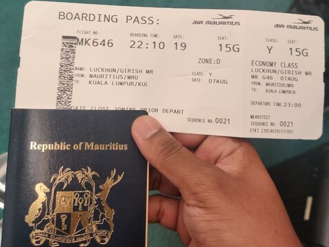
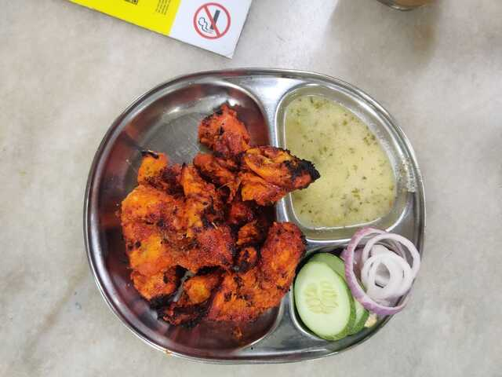

Okay, it's been some time since I wrote last and I thought to write about my vacation in Malaysia. The planning has been going on for days after one of my friends got married; A tug of Excitement. Finally, on the scheduled day(07 Aug) we boarded the Mauritius Airlines flight. 

#  Day 1 - Arrival

We arrived the following day around 3 PM. It was so freaking hot, fortunately every building, cars, bus had aircon. We stayed at the [cheapest hotel](https://www.booking.com/hotel/my/msp.en-gb.html) we could find on booking.com in Kuala Lumpur. Although, we did not like the small bathroom and toilet, the staff was nice and they cleaned our room every 3 days giving up new towel, shampoo pillow. 

After unpacking our things, we went to 7-Eleven and grab a [malaysian sim card](https://www.u.com.my/en/personal/home). And yes ofcourse, on our very first day, it was raining so freaking much, that we had to stay around 2 hours in the same building. But luckily, the malls was so huge, even 2 hours doesn't seem enough. 

We went to [Pavillion](https://www.pavilion-kl.com/) food-court for dinner. First thing i got was Burger King, which was allrighhtt. Then I saw a place seling japansese food. Bought the Signature beed curry, and boy it was good!

Around 1 am, we went out to look for food again, and we saw [this place ](https://www.youtube.com/watch?v=EzDIzWR6a1Y), we bought a plate of spicy Tandoori Ayam and [Teh Tarik](https://www.google.com/search?client=firefox-b-e&q=teh+tarik).

# Day 2 - Batu Caves

On the second day, we went to Batu Caves to visit the Gods. We took the train at 8 am.

