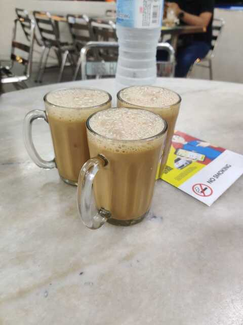

Okay, it's been some time since I wrote last and I thought to write about my vacation in Malaysia. The planning has been going on for days after one of my friends got married back in July; A tug of Excitement. Finally, on the scheduled day(07 Aug) we boarded the Mauritius Airlines flight. 

#  Day 1 - Arrival

We arrived the following day around 3 PM. It was so freaking hot, fortunately every building, cars, bus had aircon. We stayed at the [cheapest hotel](https://www.booking.com/hotel/my/msp.en-gb.html) we could find on booking.com in Kuala Lumpur. Although, we did not like the small bathroom and toilet, the staff was nice and they cleaned our room every 3 days giving up new towel, shampoo pillow. 

After unpacking our things, we went to 7-Eleven and grab a [malaysian sim card](https://www.u.com.my/en/personal/home). And yes ofcourse, on our very first day, it was raining so freaking much, that we had to stay around 2 hours in the same building. But luckily, the malls was so huge, even 2 hours doesn't seem enough. 

We went to [Pavillion](https://www.pavilion-kl.com/) food-court for dinner. First thing i got was Burger King, which was allrighhtt. Then I saw a place seling japansese food. Bought the Signature beed curry, and boy it was good!

Around 1 am, we went out to look for food again, and we saw [this place ](https://www.youtube.com/watch?v=EzDIzWR6a1Y), we bought a plate of spicy Tandoori Ayam and [Teh Tarik](https://www.google.com/search?client=firefox-b-e&q=teh+tarik).

# Day 2 - Batu Caves

On the second day, we went to Batu Caves to visit the Gods. We took the train at 8 am and reached there around 9 15am. Little history about the batu caves : Dedicated to Lord Murugan, this vibrant temple has a series of caves and cave temples. It is believed that the caves are said to be around 400 million years old.

And here’s the best part…there is no entrance fee! **Batu Caves is FREE**. Simply walk right up and admire what’s in front of you, snap some pictures, and then take on those 272 stairs. Even though the stairs look daunting, they’re actually not that bad, and you get some awesome views along the way.

But whether you just snap pictures from the bottom or are trudging up the stairs , watch out for the macaques! They are small monkeys that will steal your food and sometimes water bottle. They’re fun to take photos of, but don’t taunt them – sometimes they bite people or take your stuff. I always clutch my camera and phone tight when they’re around. 😅
<!-- [ insert pics] -->

Inside the caves there are statues and temples. You can walk freely throughout the cave. Enjoy the pics below

<!-- [ insert pics] -->

Right after, we went to [Rani Vilas Restaurant Shop](https://www.foodpanda.my/restaurant/w1rb/rani-vilas-restaurant-shop) which was around and eat some different Dosa. 

<!-- [ insert pics] -->

## New Phone

Ever since the released of the first [Nothing Phone(https://intl.nothing.tech/pages/phone-1)], I've been waiting to get my hand on the Nothing Phone 2. It was a surprise for me to find that [Low Yat](https://www.lowyat.net/) which is a shopping centre specializing in electronics and IT products do not sell the phone. So i did some research and found a store in Pavillion called[Urban Republic] (https://shop.urbanrepublic.com.my/) was selling the phone. Went there and bought it.

<!-- [ insert pics] -->

# Day 3 - Petaling Street Market, Jalan Alor

Jalan Petaling – or the famous main road of the neighborhood called Petaling Street. Within minutes of entering, I am indeed ready to keep on walking. Both sides of the crowded road are lined with hawkers, proffering me and a hundred other tourists t-shirts, belts, bags, and at least fifty different watches. We 

We returned to KL last at night and then directly to Jalan Alor which is a vibrant and colorful street in the heart of the Bukit Bintang area.

**Highlights of Jalan Alor Food Street:**
 - The street is always buzzing (at night). It has many food options, including Hawker Food, Chinese Seafood sit-down restaurants, regional restaurants including Thai, Vietnamese, and Korean, and dessert stalls like ice cream and fruit.
 - Endless list of dishes, you might struggle to make choices while wandering along this historic street!
 - Pushy people "encouraging" you into some of the eating establishments as you walk down the street.
 - Some stalls in Jalan Alor offer tropical fruits which include rambutan, mangosteen, mango, durian, longan, apple, orange, dragon fruit, and durians.

<!-- # Day 4 - Sunway Velocity, Oppenheimer
We made a trip to Sunway Velocity to watch Oppenheimer in Imax. 
Had Texas chicken for dinner.
Saw an anime store, and I geeked out.

# Day 5 - Pavillion, Petronas Tower

# Day 6 - Sushi Mentai, Berjaya Times square

# Day 7 - Graduation, banana leaf briyani

# Day 8 - MeLaka Sentral

# Day 9 - Melaka, Haunted Museum, kl, ramen

# Day 10 - Shopping Brands outlets, park, nandos, night club

# Day 11 - sunway pyramid, ice skating, night club

# Day 12 - berjaya, lalaport, nandos, night club -->
