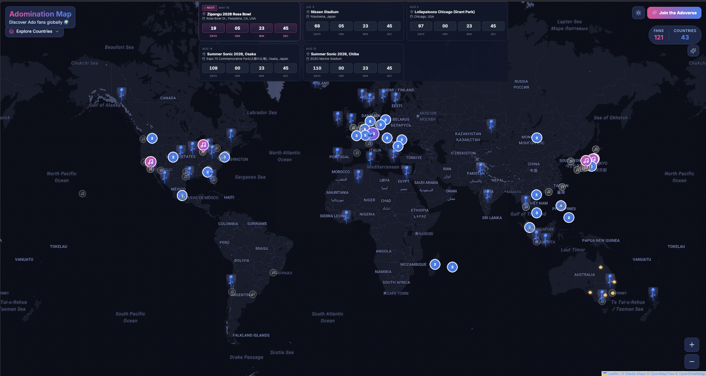
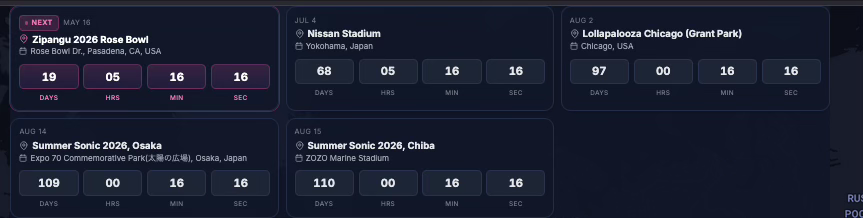

Ohayo! It’s been a while since I’ve written a blog post. I wanted to share an update on a project I’ve been working on for the past few months.

If you’ve never heard of her, [Ado](https://www.youtube.com/@Ado1024/videos) is a Japanese singer and Utaite (a singer who performs covers and original songs online). I’ve been a huge fan since she performed the songs for the One Piece Film: Red movie, where she provided the singing voice for Uta (Shanks' daughter). Ever since then, I’ve been following her journey. She has never revealed her face. I actually hope she keeps her identity a secret...you never know how the public might react, and it adds to her unique mystique.

## The Project: AdoVerse

The project I’ve been building is called AdoVerse. It is a fan community platform where fans can add their location to a global map. Many people might feel like they are the only ones in their country who listen to Ado, I created this website to show how massive the community truly is and how far her music has reached.

For example, I am from Mauritius. No one expects someone from this tiny island to be a fan! I really hope that one day Ado gets to see this project and realizes just how many fans she has worldwide.

The project is still in its early stages, but you can check it out here: https://adoverse.com/. I plan to add more features in the future to improve the experience for everyone.

### How it works

#### Blue Roses
When you open the site, you’ll see a map covered in blue roses. Each rose represents a fan. I’ve used a clustering system, when you zoom out, the roses group together to show the total number of fans in a country or region. As you zoom in, the clusters expand, allowing you to see the locations more clearly.

#### Adding your location

To add your own spot on the map, simply click "Join the AdoVerse." You can add your country, city (optional), and other details. You can also choose to keep your information private by selecting "Adonymous" (get it?) or make it public by linking your Instagram or X (Twitter) profile.

#### Concert countdown

One cool feature I added is a countdown for her upcoming concerts. If you click on a concert, the map will direct you straight to that location.

#### Past Concert
I’ve also included locations from her past tours so you can see everywhere she has performed so far.

### Future plans
I plan to change the domain to adoverse.com or something similar soon. Also in the pipeline, i want to add a library for all her songs where new fans can easily see her songs.

P.S I am going to her Nissan Stadium concert in July in Japan. SUPER EXCITED!!!!!