# Japan trip

So, a dream finally came true after years and years of wondering if I would ever get here. It's currently the first of July, and I am sitting in my hotel, [Hotel Onyado Nono Kyoto Shichijo Natural Hot Spring](https://onyado-nono-kyoto-shichijo-natural-hot-spring.hotels-in-kyoto.com/en/), in Kyoto as I start writing this blog.

## Day 1 - 24th June

I arrived at Tokyo Haneda Airport around 11:00 PM after a 7-hour flight from Malaysia. The Tokyo night view from above was f***ing breathtaking. Not gonna lie, I shed a few tears when I saw that view.

<figure style="text-align:">
  <video src="./images/v1.mp4" controls style="width: 60%; height: auto;"></video>
</figure>

My itinerary looked like this: 
* Arrive in Tokyo -> Take domestic flight to Osaka -> Stay in Osaka -> Head to Kyoto for 2 days -> Return to Osaka -> Head back to Tokyo for the rest of the trip.

### Layover at tokyo Haneda Airport
I landed at Terminal 2 at 11:00 PM, and my connection to Osaka wasn't until 8:00 AM the next morning. Back when I was planning, I thought, *"Hey, I have a 9-hour transit! I can just walk around and collect some [Eki Stamps](https://en.wikipedia.org/wiki/Eki_stamp)."* Boy, was I wrong! 

Basically, almost every Information Service desk—whether in the airport or railway stations has a unique stamp you can collect, but I completely forgot to check if they closed at night. I ended up spending the next 2 hours just wandering around a mostly quiet Terminal 2.

I got my personalized Suica card for the metro. Of course, I had to get my name printed on it!

<figure>
  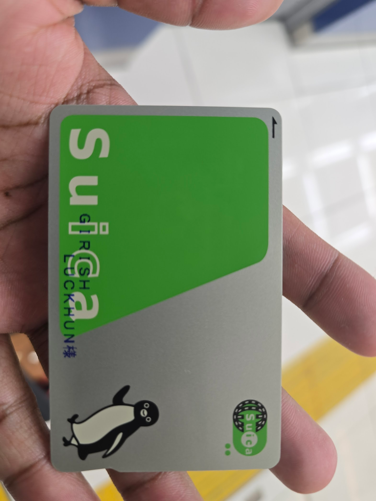
</figure>

There were plenty of vending machines around, and I was thirsty af, so I tried a drink called Pocari Sweat. I chugged the whole thing in under 2 minutes. It was so freaking good!

<figure>
  
</figure>

Around midnight, a security guard came up to inform me that Terminal 2 was closing. (*Wait, what?! I didn't know airport terminals closed! Where the hell am I supposed to go? My whole plan was to crash at the terminal!*). 

He told me I needed to transfer over to Terminal 3. Apparently, Haneda shuts down Terminals 1 and 2 around midnight, so everyone has to head to Terminal 3 to rest until morning. So I hopped on the free airport interterminal shuttle bus and made my way over.

#### Terminal 3 

Terminal 3 was huge. My feet were completely dead, and I was pretty sure I had blisters forming, so I found a spot to sit down and rested for about an hour before heading out to explore again.

At 2:00 AM, I went into Lawson and grabbed an egg sandwich, it was decent, nothing overly mind-blowing—and an onigiri.

<figure>
  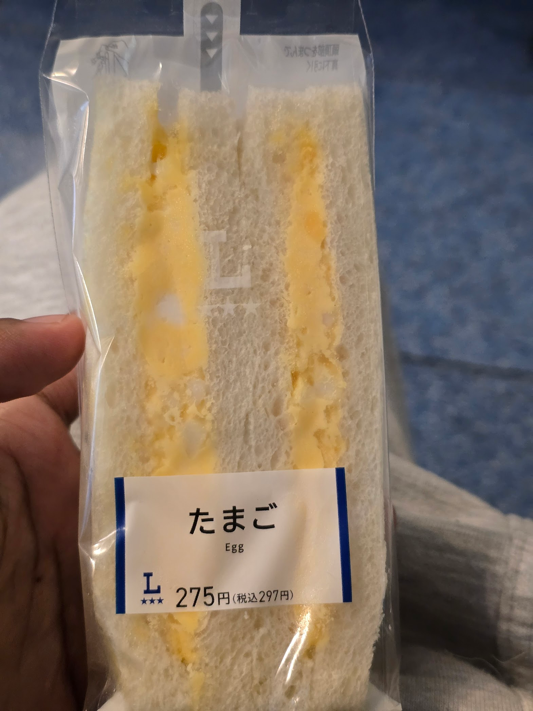
</figure>

I went up to the 3rd floor, and holy shit, I was not expecting a giant Godzilla staring down at me from above\
<figure>
  
</figure>

There was another one on the 2nd floor as well

<figure>
  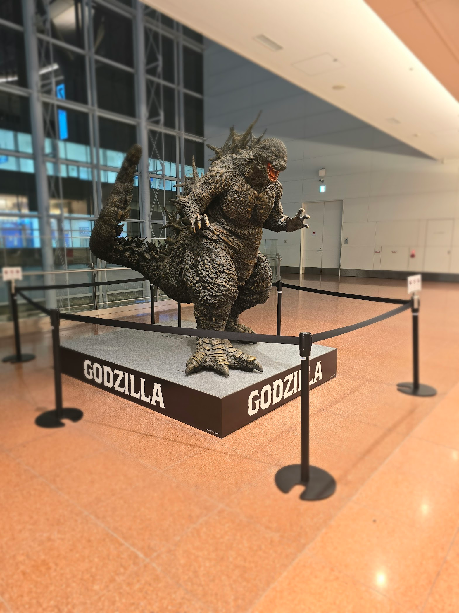
</figure>

I spent the rest of the night alternating between walking around and sitting on the benches. By the time morning rolled around, I had been awake for almost 24 hours straight!

## Day 2 -  25th June Osaka

At 6:00 AM, I waited until the Information Service desk opened and finally got my very first Eki Stamp! There were actually a few more on the upper floors, but since I was worried about missing my flight, I gave up on those and went straight to the free shuttle bus back to Terminal 2.
<figure>
  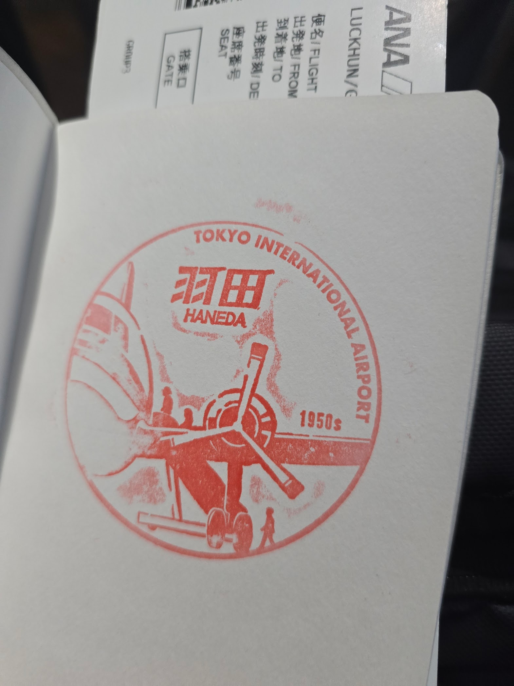
</figure>

Terminal 2 was absolutely bombarded with people as I entered, a huge contrast to last night, when it was completely empty! I checked in and headed straight to my gate. I was so excited to see Mount Fuji from the plane and had specifically booked a window seat just for the view. But guess what? Two nasty typhoons were hitting Japan, and as "lucky" as I am, it was completely cloudy so I didn't get to see it at all!

<figure>
  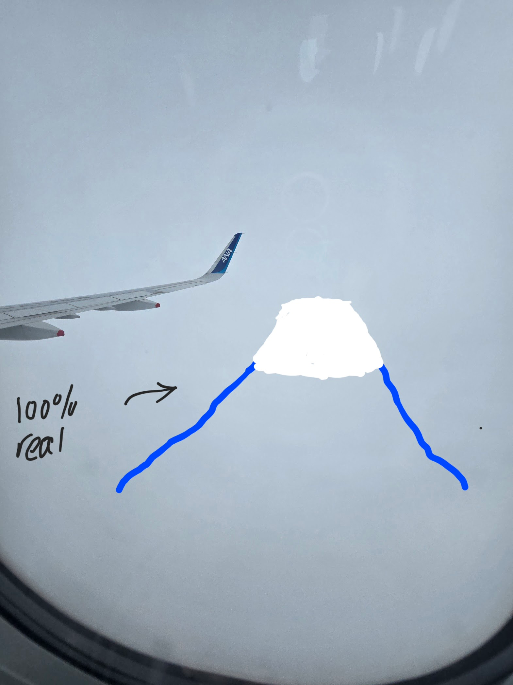
</figure>

When I arrived at Osaka Itami/Kansai Airport, navigation was surprisingly easy. I went straight to the Information Service desk to pick up the Mobal eSIM I had pre-booked. There was also another Eki Stamp there, so of course, I collected that too. The lady at the counter was so sweet when I told her I was from Mauritius, she smiled and went, *"Sugoi ne! I want to visit Mauritius too!"*

<figure>
  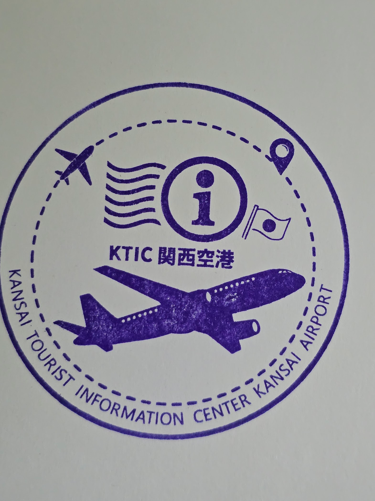
</figure>

At this point, I was so exhausted I could barely stand. During my initial planning, my idea was to take the subway to my hotel. However, the information lady recommended taking the airport limousine bus instead, as it dropped off right behind my hotel which was so much more convenient. So I took her advice!

### Apa hotel & Exploring

I arrived at my APA Hotel around 11:30 AM. I walked up to the check-in desk, only to be told that check-in didn't open until 3:00 PM (15:00). *Bruh!!!!! I could have literally cried.* They mentioned that early check-in required an extra fee, so I decided to just drop off my luggage and go for a walk instead. 

I was starving at this point. As I walked down the street, I spotted four Japanese salarymen heading into a nearby building. I decided to follow their lead and went into the exact same restaurant they entered!

I sat down and ordered a Conger Eel (Anago) Bento Set, and it was *so* good! It came with cold soba, eel over rice (the sauce was amazing!), hot miso soup, and a side broth to mix with the soba.

<figure>
  
</figure>

Since I wasn't wearing a watch on this trip, I decided to hunt one up. I found a nearby Bic Camera store and ended up buying a Garmin watch. Bic Camera was massive about seven floors! I spent nearly two hours wandering around, mostly getting lost in the anime section, of course.

<figure>
  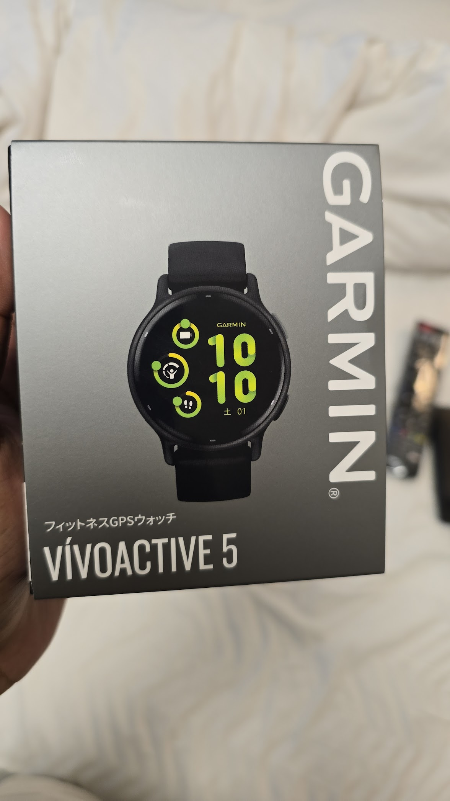
</figure>

### Evening in Dotonbori

By 3:00 PM, I finally checked into my room and immediately passed out for a much-needed rest. 

I woke back up around 9:00 PM (21:00) and headed out for a night walk through the city.

I played my very first gachapon machine of the trip and got Hedwig!

<figure>
  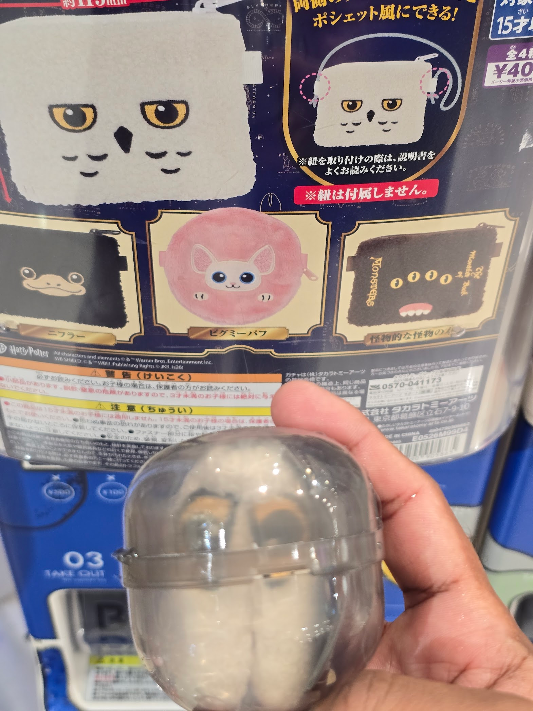
</figure>

Ayy, I finally saw the famous Glico Running Man sign in Dotonbori!

<figure>
  
</figure>

I ended up spending around ¥1,200 on a crane game trying to win a Frieren figure... but left empty-handed 🥲.

<figure>
  
</figure>

## Universal Studio Japan (USJ)

Well, here we are,the moment I’ve been waiting for! But wait... of course there was a typhoon rolling in. See how lucky I am? 

I walked down to the metro station only to be told that trains weren't running due to the severe weather, and apparently, one of the main stations on the line was flooded! With no other option to get to the park, I had to get a taxi. It cost me around ¥5,000, but I wasn't going to let a typhoon ruin my day at USJ.

The very first thing I did after walking through the gates was head straight to the Information Center to get my USJ Eki Stamp!

<figure style="text-align:">
  <video src="./images/v2.mp4" controls style="width: 60%; height: auto;"></video>
</figure>

<figure style="text-align:">
  <video src="./images/v3.mp4" controls style="width: 60%; height: auto;"></video>
</figure>

<figure>
  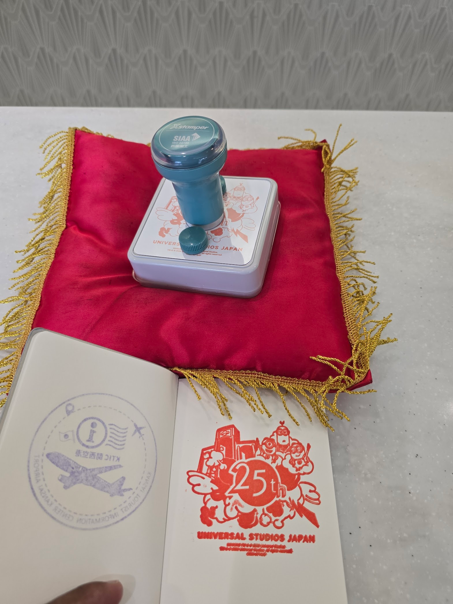
</figure>

### Detective Conan Show

USJ is absolutely massive, and honestly, I didn't really have a set plan for where to go first. I just walked toward the first attraction I saw, which happened to be the *Detective Conan* 4-D show. 

The pre-show had English subtitles on the side screens setting up the storyline, which made it super easy to follow along. The live host was so *kawaii*, and getting to see Kaito Kid make his dramatic appearance was so cool!

<figure>
  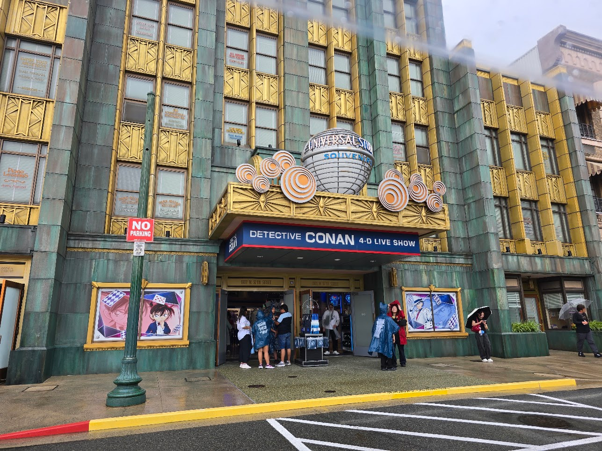
</figure>

### Minion

After Conan, I wandered over to Minion Park. The ride was okay...not my favorite but the vibrant decor and cute minion chaos still made it a lot of fun to walk through!

<figure>
  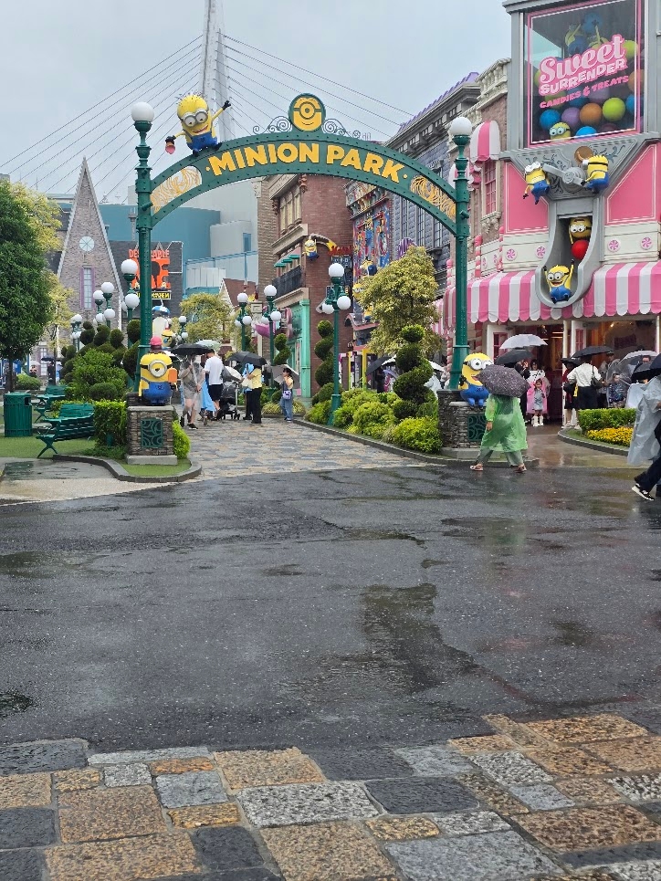
</figure>

<figure>
  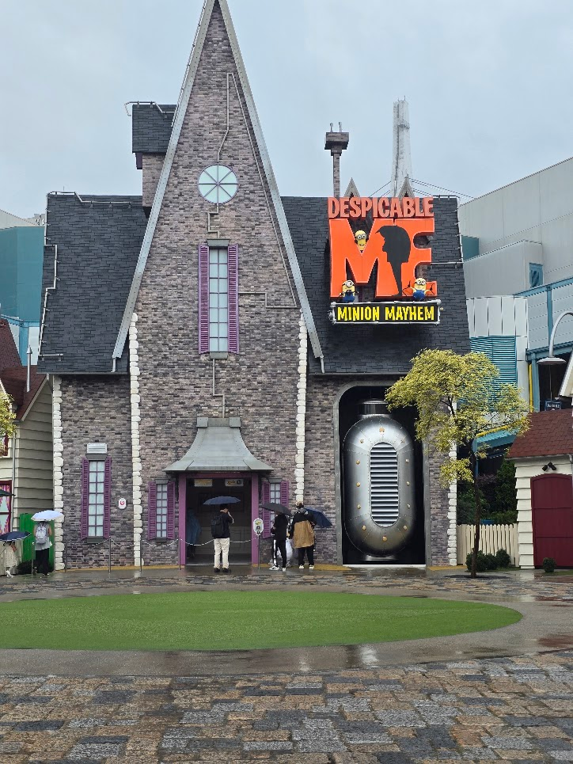
</figure>

### Flying Dinosaur

Oh boy... while walking around, I could hear people on the ride screaming their absolute lungs out. I was so excited for this! Believe it or not, I had never been on a rollercoaster or theme park ride before in my life, so this was going to be my absolute first experience. 

<figure>
  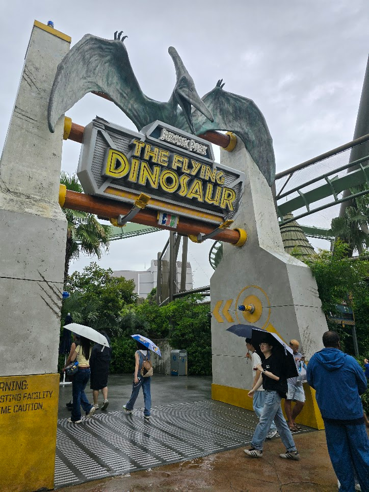
</figure>

<figure style="text-align:">
  <video src="./images/v4.mp4" controls style="width: 60%; height: auto;"></video>
</figure>

<figure style="text-align:">
  <video src="./images/v5.mp4" controls style="width: 60%; height: auto;"></video>
</figure>

And holy hell, it did NOT disappoint!
I could literally feel my soul coming out of my body on those drops, but I held it together and didn't scream xD. It was literally one hell of a ride—now I completely understand why some people faint on these things!

*P.S. I ended up riding it three times!*

### The Wizarding World of Harry Potter

If you know me, you know I’ve been a massive Harry Potter fan since childhood. Stepping into Hogsmeade and seeing Hogwarts Castle looming in front of me was a huge moment. Even though I was standing there looking completely stone faced on the outside, I was screaming with pure excitement on the inside!

Ah, nothing to see here, just a random light blue 1962 Ford Anglia 105E parked in the forest:
<figure>
  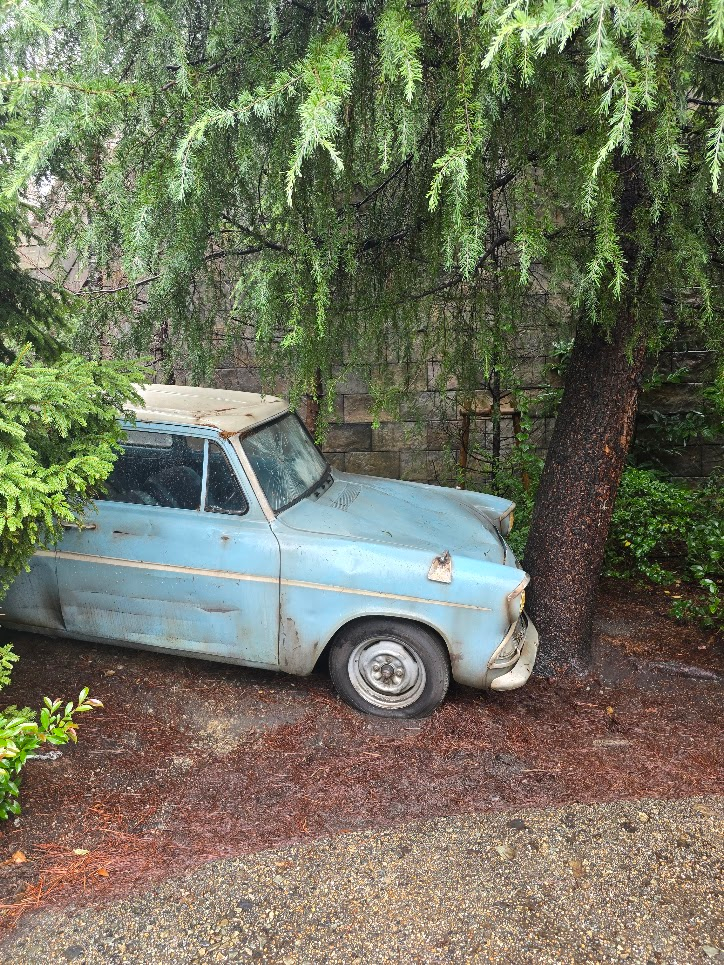
</figure>

Stepping into Hogsmeade... AHHHHHH! I'm finally here!

<figure style="text-align:">
  <video src="./images/v6.mp4" controls style="width: 60%; height: auto;"></video>
</figure>

Hogwarts Express Train
<figure>
  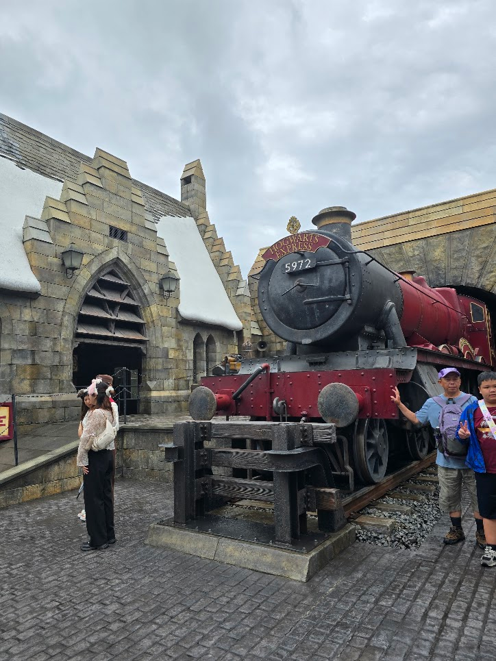
</figure>

The Monster Book of Monsters
<figure style="text-align:">
  <video src="./images/v7.mp4" controls style="width: 60%; height: auto;"></video>
</figure>

Ohh hi there, it's me! Well, since it was raining, I obviously had to get myself the official Wizard Raincoat

<figure>
  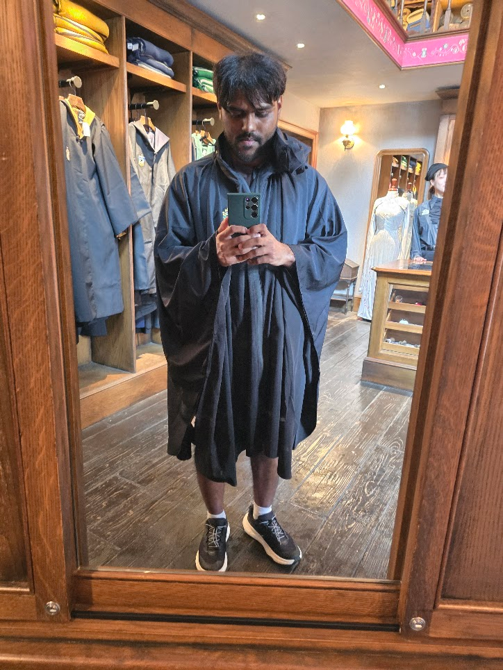
</figure>

Finally, seeing Hogwarts right in front of me:

<figure>
  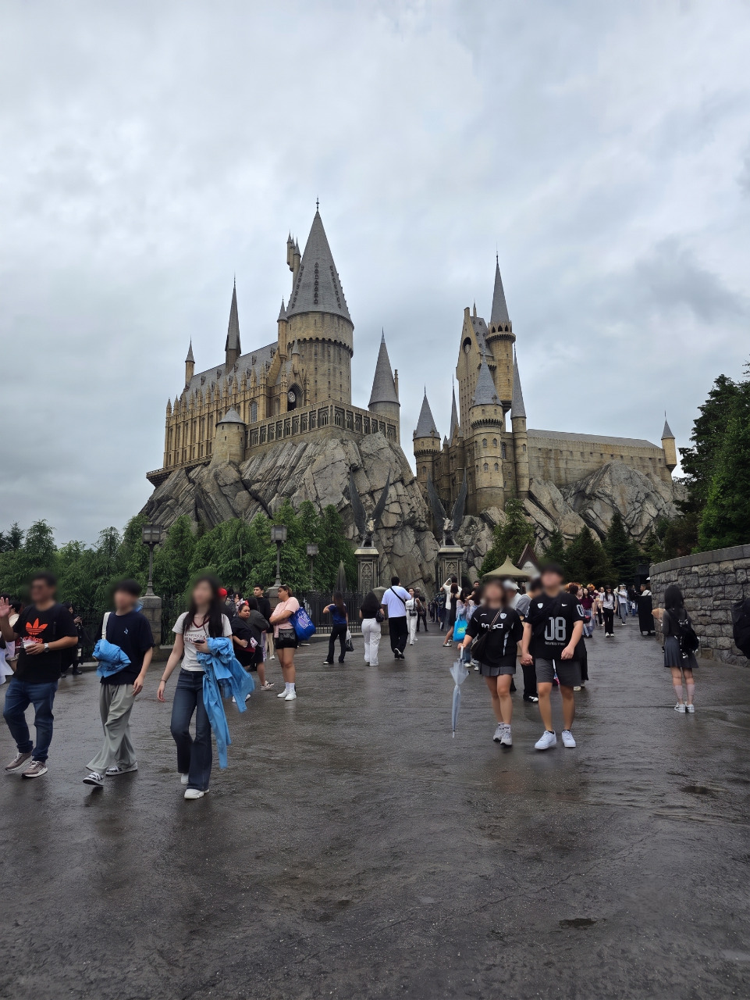
</figure>

First time trying Butterbeer! It was a bit too sweet for my taste, but worth a try:

<figure>
  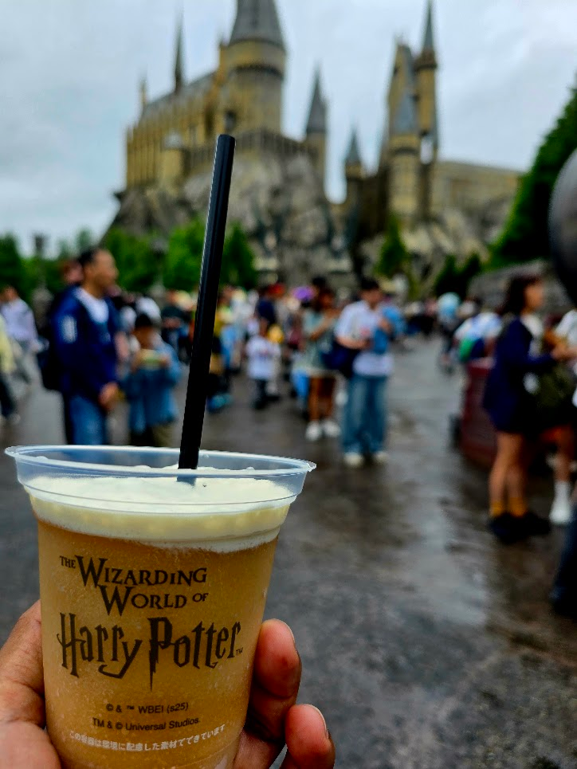
</figure>

Inside Hogwarts Castle

<figure style="text-align:">
  <video src="./images/v8.mp4" controls style="width: 60%; height: auto;"></video>
</figure>

I didn't manage to take too many pictures and videos inside, but it was exactly as magical as I expected. Seeing the Sorting Hat talk in person and walking through the castle hallways was incredible. 

The queue for *Harry Potter and the Forbidden Journey* was long, but thanks to the Express Pass, I got priority access and only waited about 10 minutes! The ride itself was amazing seeing the flying Dementors up close was insane, and the Aragog spider scene actually jumpscared me!

After *Forbidden Journey*, I jumped on the *Flight of the Hippogriff* coaster. Since it was outdoors, I rode the whole thing in the pouring rain!

<figure style="text-align:">
  <video src="./images/v9.mp4" controls style="width: 60%; height: auto;"></video>
</figure>

Hagrid's Hut

<figure>
  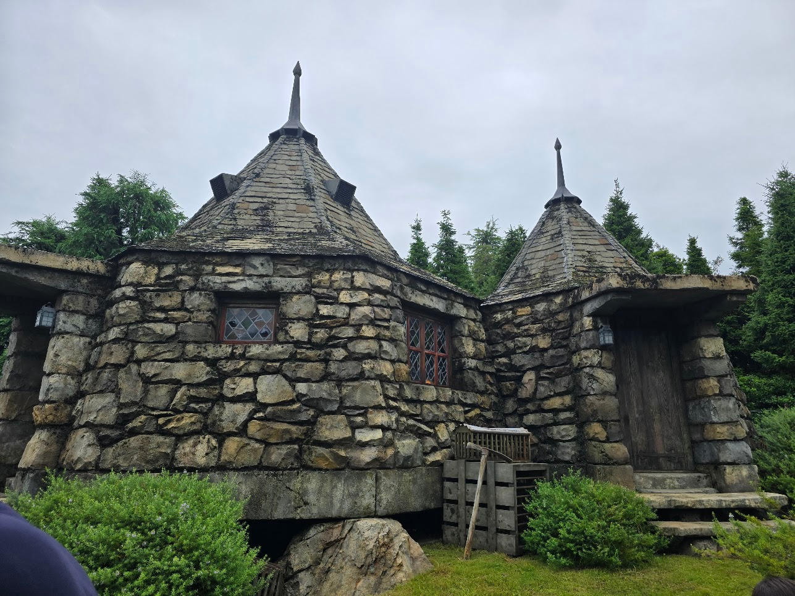
</figure>

I headed back to Hogsmeade to do some proper shopping and bought myself a Gryffindor house cloak!
<figure>
  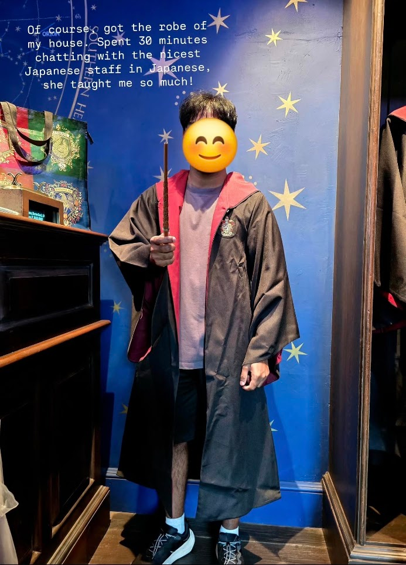
</figure>

I actually spent around 30 minutes chatting with one of the shop staff members. I showed her the plush Dodo I brought with me from Mauritius, and she taught me a few Japanese words, it was such a fun interaction!

Just a Gryffindor taking it all in:

<figure>
  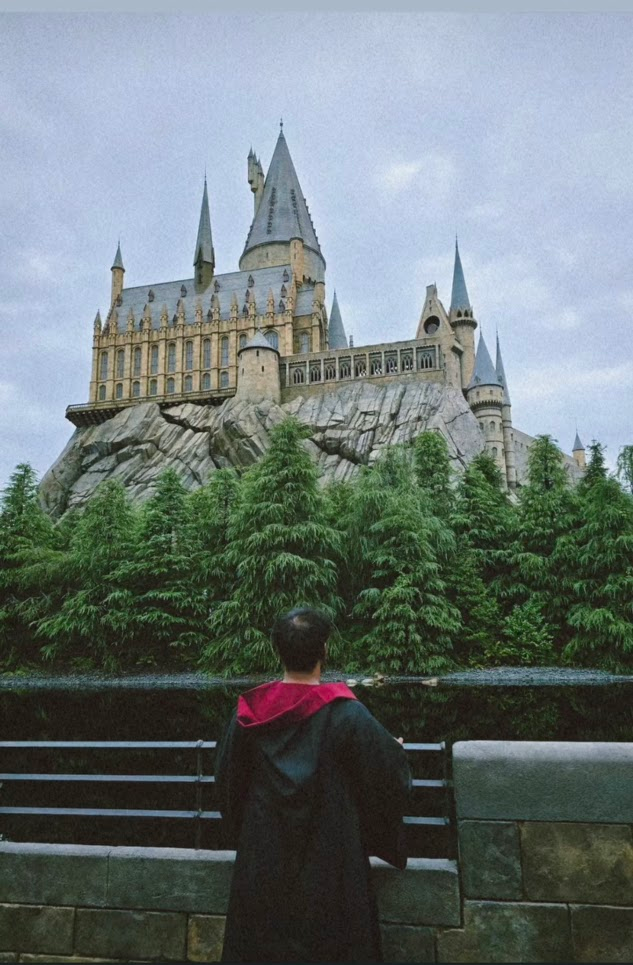
</figure>

 
### Frieren
Next up, I went over to the *Frieren: Beyond Journey's End* experience. Unlike the Conan show, this one didn't have English subtitles, but I was totally fine following along in Japanese. I was the only foreigner in the entire group rocking my Gryffindor cloak among all the Japanese fans!

<figure>
  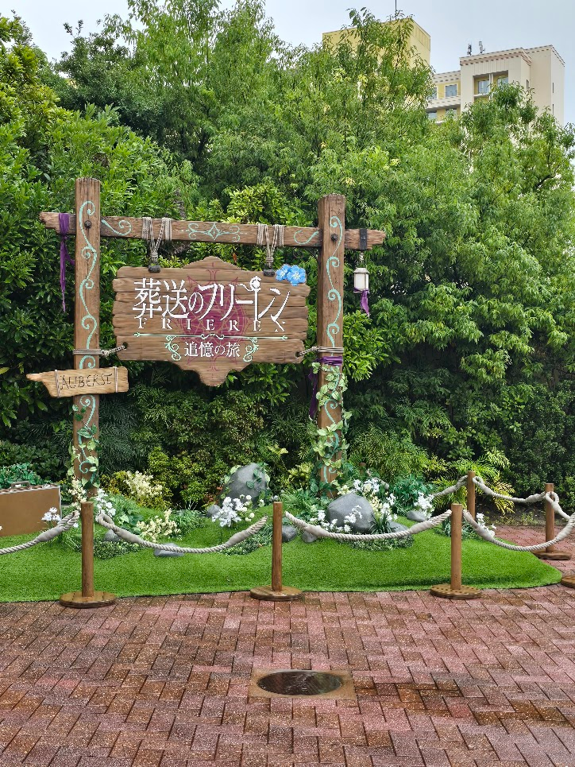
</figure>

Photography wasn't allowed inside, but it was designed as an immersive journey following Frieren, Fern, and Stark. Frieren’s magic takes you on a walk through memories, and it was such a beautiful, atmospheric experience.

And as always, Frieren can't resist checking a chest...

<figure>
  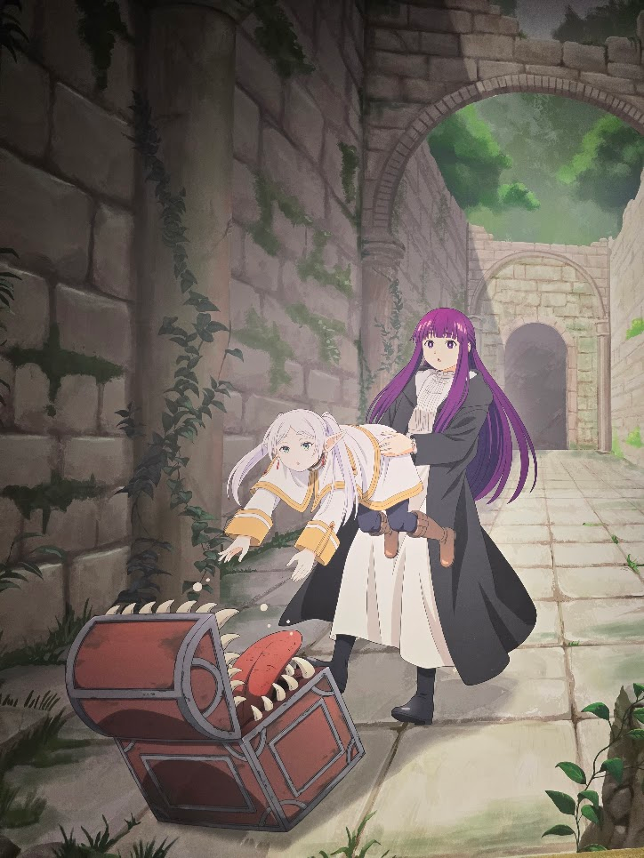
</figure>

Yeah, yeah, go ahead and make fun of my hair... xD

<figure>
  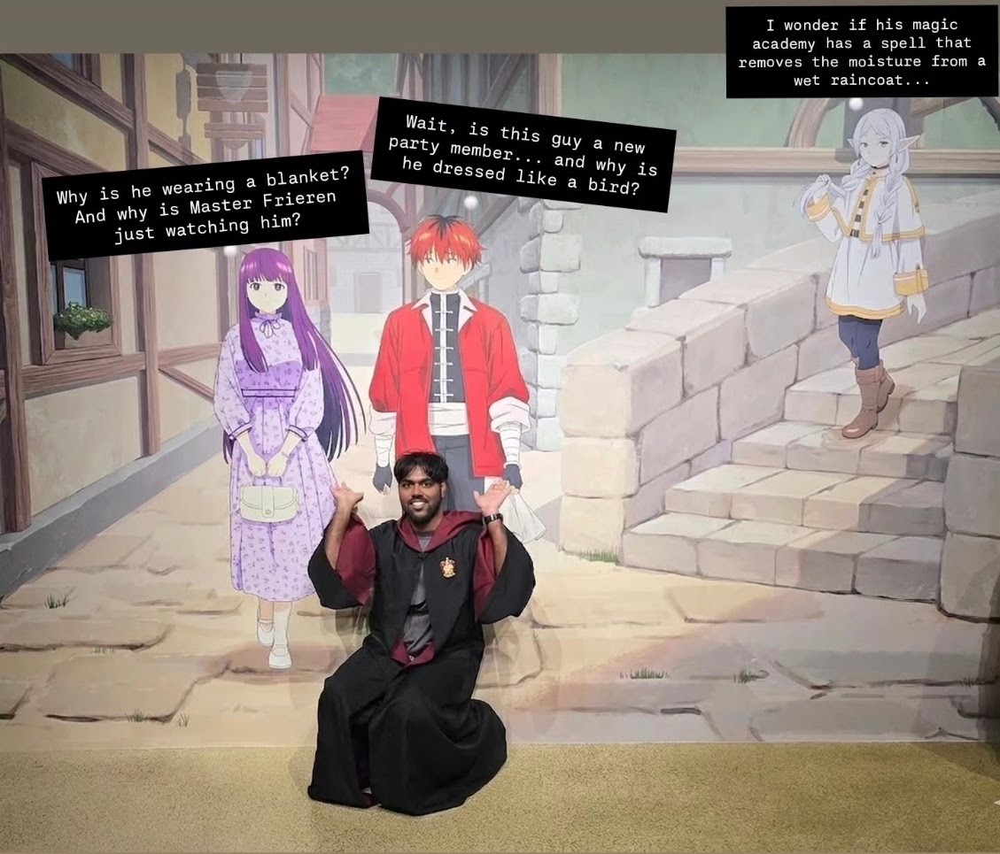
</figure>

### Nintendo World

Ah, the famous Super Nintendo World! As expected, it was completely packed with people. I went on some rides it was super cool, but definitely crowded.

<figure style="text-align:">
  <video src="./images/v10.mp4" controls style="width: 60%; height: auto;"></video>
</figure>

Yoshi's Adventure

<figure style="text-align:">
  <video src="./images/v11.mp4" controls style="width: 60%; height: auto;"></video>
</figure>

<figure style="text-align:">
  <video src="./images/v12.mp4" controls style="width: 60%; height: auto;"></video>
</figure>

Toad
<figure style="text-align:">
  <video src="./images/v13.mp4" controls style="width: 60%; height: auto;"></video>
</figure>

Princess Peach
<figure style="text-align:">
  <video src="./images/v14.mp4" controls style="width: 60%; height: auto;"></video>
</figure>

### Hollywood ride
Hollywood Dream was intense, though not *quite* as terrifying as *The Flying Dinosaur*. By this time, it was raining heavily, so by the time I stepped off the coaster, I was completely drenched!

### harry potter again
Around 6:00 PM, I made my way back to the Wizarding World one last time. I re-rode the attractions and hung around Hogsmeade until the evening lights turned on, illuminating Hogwarts Castle against the night sky—the perfect finish to a wild, typhoon-filled day at USJ!

How I ended up after spending 6+ hours at USJ in a typhoon

<figure>
  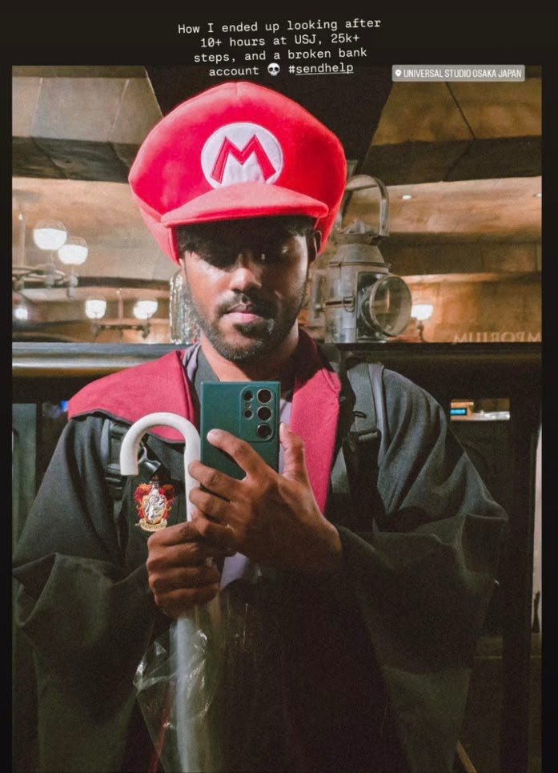
</figure>

## Day 3/4 - Weekends

I decided to keep it light on the weekend, so i focused more on doing some shopping agt Uniqlo. The clothes there so light and inexpensive. 

Also saw Ado-chan and bought a japanese football shirt.

So broke that I only ate a sandwich for dinner 🥲
<figure>
  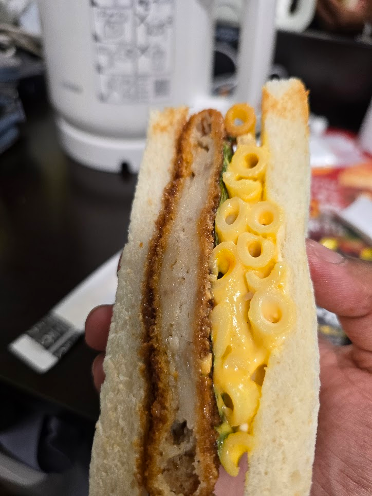
</figure>

### Nipponbashi Denden Town

Nipponbashi Denden Town is essentially the mini Akihabara of Osaka. As an otaku myself, I had to go! There were several buildings stacked with anime figures and merch. I specifically went on a hunt for the first volume of the *One Piece* manga, which is surprisingly hard to find. After searching through almost every single store, I finally found it! 

I ended up grabbing a whole stack of manga, including *One Piece*, *Frieren*, *Jujutsu Kaisen*, and *Attack on Titan*.

<figure>
  
</figure>

### HARUKAS 300 × Frieren: Beyond Journey's End

About a week before coming to Japan, I found out that the HARUKAS 300 observation deck was having a collaboration with *Frieren*. Naturally, I knew I had to go!

Funny story: when I checked Google Maps, it said it was only 3.3 km away. Silly me thought, *"Hey, I can easily walk that!"* So I did... and it felt like an absolute eternity. But no regrets at all, because I got to see some really cool scenery along the way.

<figure>
  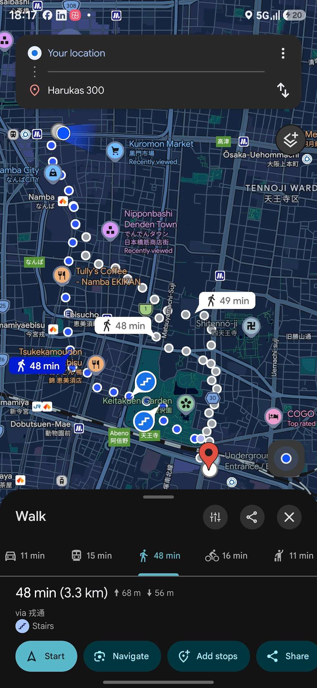
</figure>

<figure>
  
</figure>

The view from the top was breathtaking.

<figure>
  
</figure>

I stayed until it got dark for the *Frieren* projection mapping show. They even had a special *Frieren* stamp rally event!

<figure>
  
</figure>

<figure>
  
</figure>

I definitely took the subway on the way back! Ended the day with a massive 32k steps completed.

<figure>
  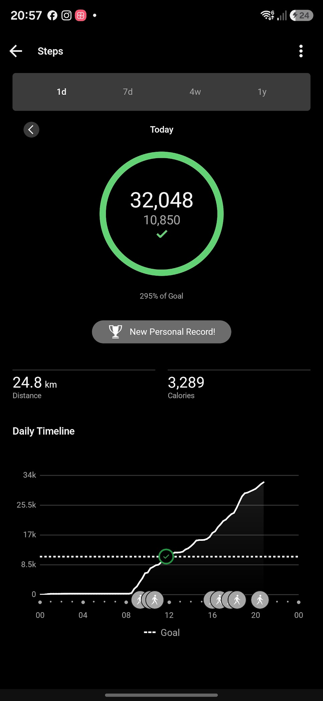
</figure>

## Day 5 - Monday

I found a place online called Shuttle House, which sells all kinds of badminton gear. I decided to head over and buy myself a new racket since I broke my last two that I got from Thailand. The prices were pretty good, and I also picked up a pair of Asics badminton shoes. The shuttlecocks were expensive, though!

### Osaka Aquarium Kaiyukan

In the afternoon, I went to the Osaka Aquarium Kaiyukan. The journey there was super easy since, by this time, I had already familiarized myself with Osaka Station!

Personally, I'm not a huge fan of aquariums, but while I was doing my research before the trip, I saw so many people recommending it,so I went ahead and booked a ticket on Klook to check it out.

<figure>
  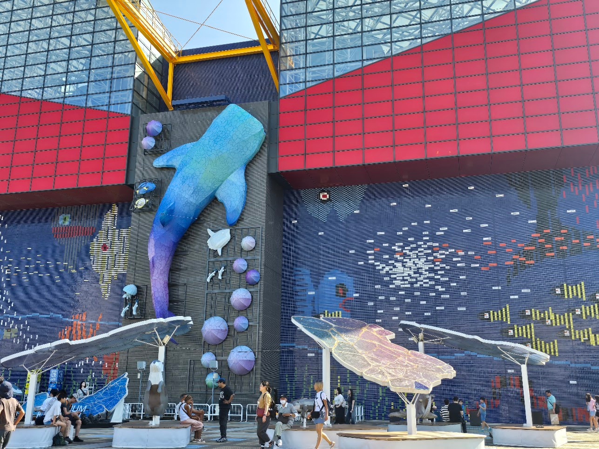
</figure>

Yeah, imagine going to the aquarium just to get flexed on by a pair of penguins. fml...

<figure style="text-align:">
  <video src="./images/v15.mp4" controls style="width: 60%; height: auto;"></video>
</figure>

White Shark
<figure style="text-align:">
  <video src="./images/v16.mp4" controls style="width: 60%; height: auto;"></video>
</figure>

Whale

<figure style="text-align:">
  <video src="./images/v17.mp4" controls style="width: 60%; height: auto;"></video>
</figure>

These tiny garden eel was kinda kawaii

<figure style="text-align:">
  <video src="./images/v18.mp4" controls style="width: 60%; height: auto;"></video>
</figure>

True! How I ended up after another 20k steps:

<figure>
  
</figure>

## Day 6 - Kyoto - Tuesday

- broke a cup at station
- hotel, left my luggage
- shoes 

### Kibune

- Attend shrine/ceremony
- kamo river at night

## Day 7 - Kyoto - Wednesday

- Yasui Shrine morning
- yasaka shrine

- afternoon, went to Nintendo museum

## Day 8 - Osaka

- got my racket, bought some grips

## Day 9 - Last day in Osaka

- light day
- walk around dotonbori
- shoppoing at daiso

## Day 10 - First Day in Shinjuku, Tokyo (Pre-Ado Concert)

Finally, the day I’ve been waiting for! 

I woke up around 8:00 AM, and since checkout was at 10:00 AM, I got straight to organizing my luggage. Carrying a massive suitcase with me all the way from Osaka to Tokyo would have been a complete pain in the back. Thankfully, my hotel offered luggage forwarding! I went down to the lobby around 9:30 AM, and the staff member there was super friendly and helpful. I provided him with my next hotel details, and the total cost for forwarding was around ¥2,000.

To get from Osaka to Tokyo, I took the Shinkansen (the bullet train). I had already booked my ticket prior to arriving in Japan. While waiting on the platform, I noticed several other fans wearing Ado merch!

Ado was actually holding a two-day concert at [Nissan Stadium](https://www.nissan-stadium.jp/) in Yokohama, and I was lucky enough to secure a ticket for the second day. I initially thought I had bought a ticket for the first day, but after triple-checking my confirmation email later on, I realized it was actually for day two. Anyway... I really wanted to go to the first day's show as well, but Ticketboard was only selling day two tickets when I checked—which sucked because I already had one for that day!

Anyway, I hopped on the Shinkansen. If you remember from earlier when I flew into Japan, I booked a seat specifically to catch a view of Mount Fuji, but couldn't because of the typhoon. Well, I made sure to book the Mount Fuji side for this train ride, too. BUT GUESS WHAT?? MOUNT FUJI WAS SHY AGAIN! I didn't get to see it fully just a tiny bit of the tip peaking out through the clouds.

<figure>
  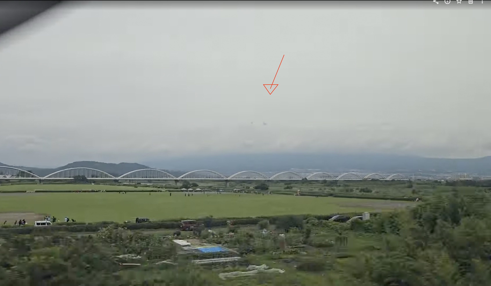
</figure>

I got off the Shinkansen at Tokyo Station and transferred to the subway to head to Shinjuku. Surprisingly, even though I had fully prepared myself to get completely lost inside Shinjuku Station, navigating to the exit was actually pretty straightforward! 

By the time I made it out, it was already around 3:00 PM (15:00), so I went straight to my hotel to check in. I stayed at the [Shinjuku Prince Hotel](https://www.princehotels.com/shinjuku/), which was included in the official JTB travel package I booked to secure my concert ticket.

I stopped by the JTB  desk in the lobby to pick up my concert ticket and to my surprise, they also handed me a bundle of bonus concert goodies! Major kudos to them!

<figure>
  
</figure>

I had a quick chat with the JTB staff since my forwarded luggage wouldn't be arriving until the next day. I wanted to doublecheck if they could store my bags after checkout, since I'd be leaving early for the concert. He went ahead and confirmed with the hotel staff, who happily agreed to hold my luggage until I returned!

The view from my room on the 16th floor was mindblowing, I could even see the famous Godzilla head right from my window!

<video src="./images/v20.mp4" controls width="100%">
</video>

For dinner that night, I went to Ichiran Ramen.

<figure>
  
</figure>

## Day 11 - Day of the Concert

Ahhhhh!!! The day is finally here!

Yesterday was Day 1 of the concert, and I successfully managed to avoid every single setlist spoiler online. However, I found out that fans both yesterday and today were already queuing up as early as 6:00 AM. What are you guys doing?! The concert doesn't even start until 6:00 PM (18:00)! But then again... what do I know? This was my very first time attending a concert in my entire life! I also saw that Adidas was selling a special FIFA x Ado collaboration jersey. I wanted to get one so badly, but it sold out almost instantly.

I left my hotel around noon to head over to Yokohama, where the concert was being held and boy, I did NOT expect to get lost as many times as I did. I took the train towards Yokohama Station, intending to transfer to the line heading toward Shin-Yokohama Station near Nissan Stadium. But somehow, I don't even know how I managed it, I completely messed up the transfer and ended up in places I'd never even heard of!

Eventually, I spotted a few Ado fans in merch and decided my best strategy was to just follow them. After taking two more subway lines, I finally, *finally* arrived at Nissan Stadium. It was quite a long walk from the station to the venue, and my god... there were SO many people. I mean A LOT!!!

Here is a video I took showing the massive merch line:

<video src="./images/merch_line.mp4" controls width="100%">
</video>

Oh hey Dodo-san, meet Ado-chan!!

<figure>
  
</figure>

I walked around the stadium area until 2:00 PM (14:00) while waiting for general merchandise sales to open at 3:00 PM (15:00). I managed to get almost everything I wanted! The only thing I missed out on was the T-shirt, which unfortunately sold out in my size. But I was so hyped to finally get my hands on the official penlight!

<figure>
  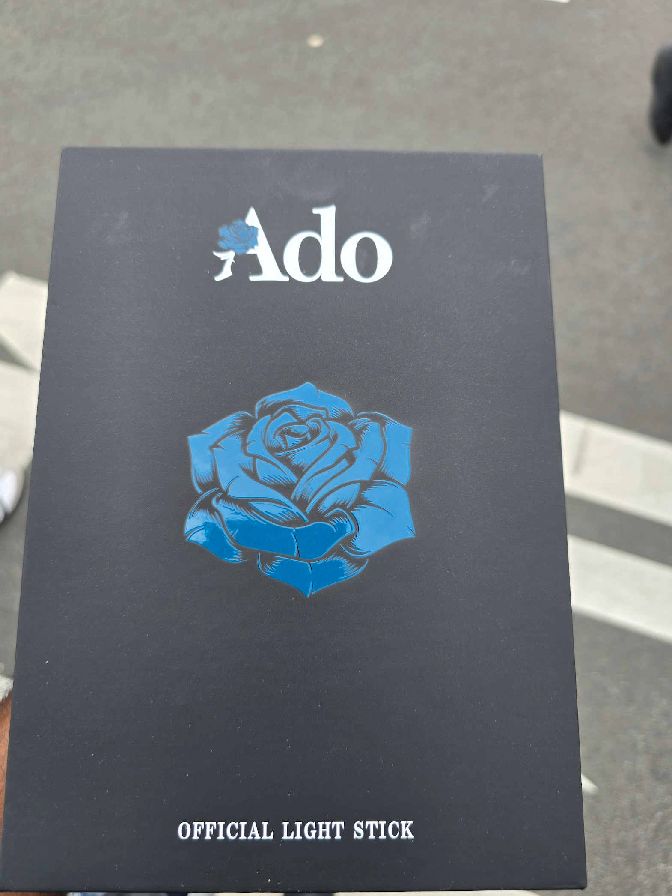
</figure>

Treated myself to some Ado-themed beef dish before the big event!

<figure>
  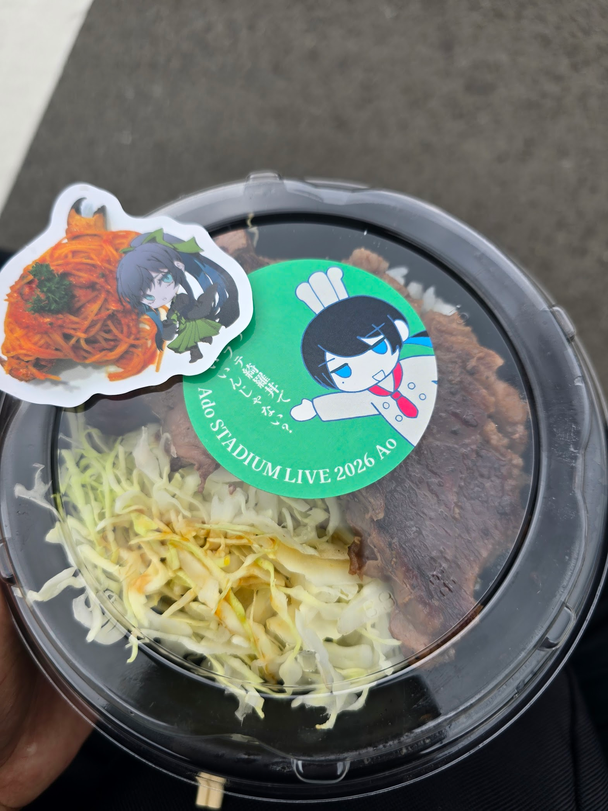
</figure>

The inside of the stadium was freaking hugeeee!!! My seat was on the East Side, Row 2, Number 131. It was pretty far back from Ado, but I still had a decent view of the whole stage.

<figure>
  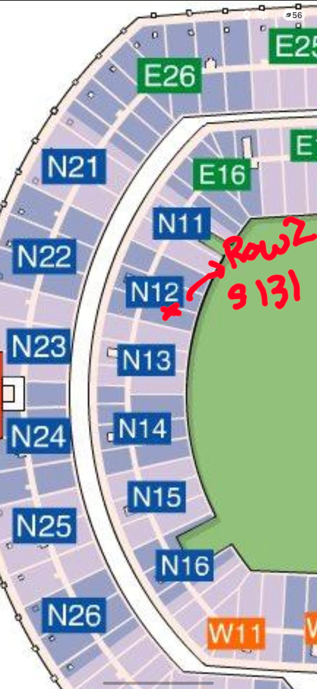
</figure>

## Phantom Siita

Around 5:00 PM (17:00), we got the opening act from [Phantom Siita](https://www.youtube.com/@PhantomSiita). My god, they were amazing! They performed for about 30 minutes, and I was especially hyped when they played [Zoku Zoku](https://www.youtube.com/watch?v=H-1oG5U0NAo) it’s one of my absolute favorite songs from them, and saving it as their final song was such a high note to end on. Their facial expressions and stage presence were so incredible to watch live!

<figure>
  
</figure>
<figure>
  
</figure>
<figure>
  
</figure>
<figure>
  
</figure>

pictures are from [Phantom Siita's twitter account](https://x.com/PhantomSiita). Aren't they kawaiii!!!

## ADOOOO

18PM!! 
AHHHHHH!!!!!!

As soon as her silhouette appeared inside the cage, she began singing. I got instant goosebumps the moment I heard her voice live!

Here is her full setlist:

### Main Show
1. [0](https://www.youtube.com/watch?v=8vm3Tkv43jw)
2. [Usseewa](https://www.youtube.com/watch?v=Qp3b-RXtz4w)
3. [Ready Made](https://www.youtube.com/watch?v=jg09lNupc1s)
4. [Gira Gira](https://www.youtube.com/watch?v=sOiMD45QGLs)
5. [Backlight](https://www.youtube.com/watch?v=gt-v_YCkaMY)
6. [Kira](https://www.youtube.com/watch?v=qpcz3-iDUP8)
7. [Angel Seek](https://www.youtube.com/watch?v=aGSmxr-dUq0)
8. [Lucky brute](https://www.youtube.com/watch?v=u-G_zzhLSy8)
9. [Rule](https://www.youtube.com/watch?v=0Z_YqhYHhpg)
10. [Ai Ai Ai](https://www.youtube.com/watch?v=K9xb-JrhG50)
11. [Tot Musica](https://www.youtube.com/watch?v=V9_ZpqfqHFI)

That was ELEVEN songs sung back-to-back in a row by Ado with pure power!!!!

Next, a live orchestra joined her on stage

12. [I'm invincible](https://www.youtube.com/watch?v=sk1Z-Hqwwog)
13. [Dancing in Spring](https://www.youtube.com/watch?v=xIYfDbkq-SM)
14. [Elf](https://www.youtube.com/watch?v=SbxR25brgoE)
15. [Where the Wind Blows](https://www.youtube.com/watch?v=iDvuZ7mRiJ0)

Right after that, we got the band member introductions!

16. [Chocolat Cadabra](https://www.youtube.com/watch?v=c5j7lpWprro)
17. [Show](https://www.youtube.com/watch?v=Igr6jQJEoNs)
18. [Monstruo](https://www.youtube.com/watch?v=syxDLGymOKI&pp=ygULTW9uc3RybyBhZG8%3D) - this is her new song

She then gave her MC talk and announced that she would be singing her last song of the main set.

Here is a summary of what she shared:

> Ado explained that the title *"AO"* comes from her own real name, which was revealed in the book about her life published this past February. She wanted a title that felt honest rather than posturing.
> 
> She reflected on how singing makes her feel free, and how glad she is to have worked as the character "Ado." She mentioned that her shows usually don't have long MC talks, and noted that this was her first outdoor stadium show since National Stadium.

19. [New Genesis](https://www.youtube.com/watch?v=1FliVTcX8bQ)

### Encore

Well, nobody was fooled into thinking it was actually over! Everyone around my section started screaming *"Ankōru!! Ankōru!! Ankōru!!"*

After a short break, she came back—and this time, she was inside a mobile cage that literally moved around the stadium track!

She sang *Odoru Ponpokorin*, and it was the cutest thing seeing the members of Phantom Siita walking and dancing alongside the cage with the mascots.

<figure>
  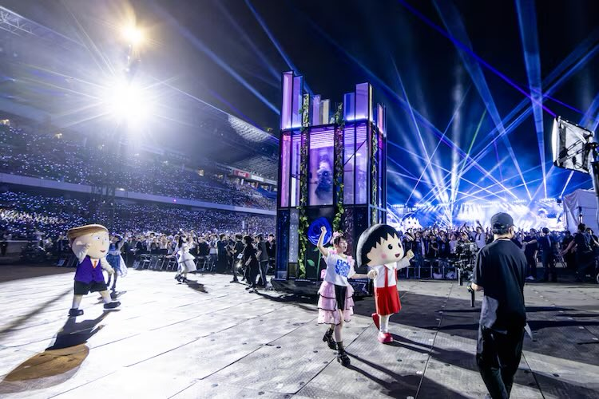
</figure>

And GUESS WHAT?? The cage passed right in front of me! She was literally just 2 meters away! Even with her mask on, she looked stunning, and seeing Miu, Moka, Rinka, and Mona up close was insane! She kept singing as the cage made its way back to the main stage.

1.  [Odoru Ponpokorin](https://www.youtube.com/watch?v=TZYqDl19qLQ)
2.  [Love me forever!](https://www.youtube.com/watch?v=WSuAVkaSC38)
3.  [I'm a Controversy](https://www.youtube.com/watch?v=lZGo8jcEW2M)
4.  [Freedom](https://www.youtube.com/watch?v=hgyGhu49sGc)
5.  [Off-limits](https://www.youtube.com/watch?v=JebU4hMBVWw)

Then came the massive surprise...she brought **Mafumafu-san** out on stage to perform alongside her! Nobody saw it coming, and the entire stadium erupted in screams. Hearing Mafumafu and Ado sing together live was unreal. 

25. [The Enigma Called Heart ](https://www.youtube.com/watch?v=BMb5IetESGE) - (Mafumafu Guest)

Ado expressed her deep respect for Mafumafu, noting that he wrote songs for her and helped build the utaite scene and future she now stands in. 

Mafumafu-san shared a special message to Ado-san:

> *"For me, it's incredible how you're filling up this massive venue, Nissan Stadium, with just your voice and your presence alone. Truly amazing.*
> 
> *You said that you exist because of all the previous singers and the people who built the utaite scene, but without a doubt, it's YOU who is leading the current music scene, the artist scene, and the utaite scene!"*

<figure>
  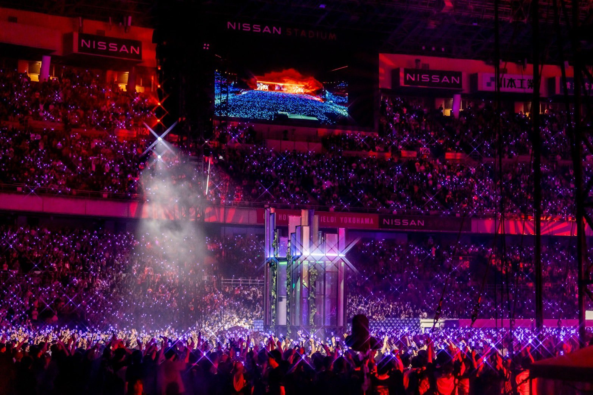
<figure>
  
</figure>
<figure>
  
</figure>

After this, Ado gave another long, deeply emotional MC talk:

> Ado admitted that she has thought about quitting as a singer before, and recently even struggled with not wanting to live, but shared that her love of Vocaloid, singing, and belief in her future carried her through.
> 
> She shared that growing up, she was made to feel like a "bad kid" and still falls into that mindset, but that she truly likes herself when she is singing. She wants to repay everyone who believes in her, and feels that if her life can be useful to others, she is allowed to keep living.
> 
> She told the crowd that she wants to be a refuge for their negative emotions, reminding everyone that as long as she is out there singing, no one is worthless.

She then introduced her final song, describing herself as a supporting character in everyone's lives:

I mean... HOW CAN YOU NOT CRY?! She was crying so hard on stage, man! You could feel every single ounce of raw emotion in her voice. Hearing her pour her heart out like that had the whole stadium in tears. GODDD.😭

26. [Vivarium](https://www.youtube.com/watch?v=6qO4x3fQ1K0)

<figure>
  
</figure>

## Concert Ends

## Merchandise Haul 
Here is all the awesome merch I managed to pick up from the venue! 

<figure>
  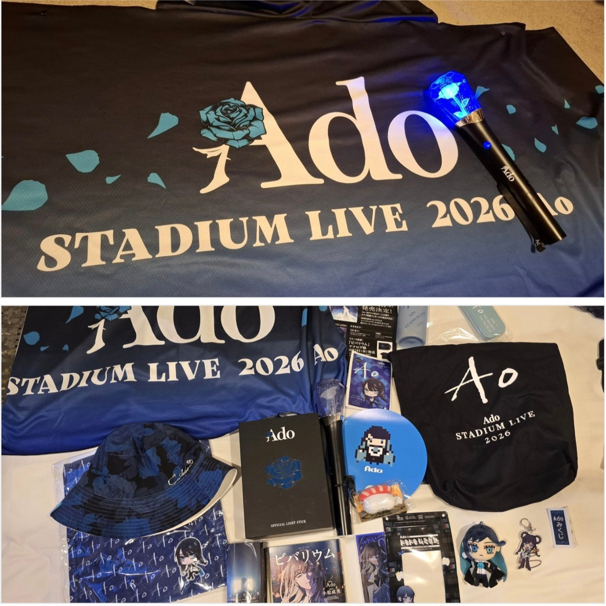
</figure>

## Day 12 - Monday - Post concert Depression

Last night was easily the best night of my life. But now... the post-concert depression has officially hit.

I checked out of my hotel around 11:00 AM to head over to Asakusa.

### Asakusa

Asakusa has a much more traditional Japanese vibe. I booked a traditional Ryokan hotel here for one night. 

As soon as I stepped outside in Asakusa, the very first thing I spotted was the famous Giant Golden Poop!

<figure>
  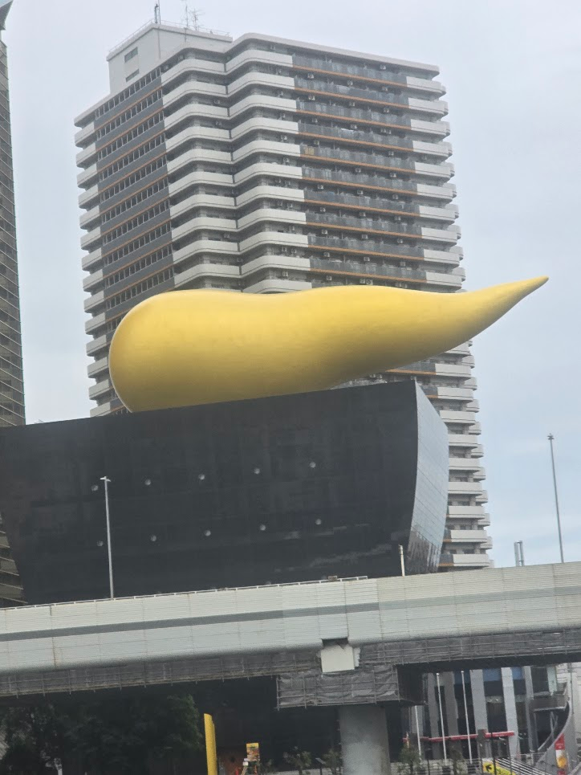
</figure>

Rickshaws are really popular around Asakusa. While I was walking, one of the rickshaw drivers approached me and explained the local spots, asking if I wanted a tour. I really wanted to try it, but it was just too expensive—¥4,000 for 12 minutes! I was pretty shocked when he mentioned he could even pull the rickshaw all the way to Shibuya (which takes around 5 to 6 hours!)... but yeah, I ended up passing on it.

After checking into my hotel, which was super traditional and cozy, I spent the rest of the day taking a peaceful walk along the Sumida River and visiting Sensoji Temple. The temple itself was really beautiful, though as expected, there were way too many people!

## Day 13 - Shinjuku

## Day 13 - Shinjuku

I checked in at Hotel Gracery (the Godzilla hotel), was definitely on the pricier side, but I really wanted to stay here at least once! 

The first thing I did was head over to the Adidas Store. Unfortunately, they had already removed the giant Ado statue that was previously in Miyashita Park. I went inside hoping to buy the official Japan jersey, but my bad luck struck again...every single Japan jersey was completely sold out! I really wanted to get one customized with "Ado" on the back, but the only size left anywhere was 3XL. It was literally SOLD OUT ALL ACROSS JAPAN! 

Thank goodness I managed to pick up the long sleeve version back in Osaka while it was still in stock!

### Unexpected Interview in Shinjuku

That evening, I was invited out for Yakiniku by a local Japanese host. Actually, let me rephrase that..I was invited to do an interview! A few days prior, someone had reached out asking if I’d be down to do a food interview eating Japanese cuisine. I mean, hell yeah, of course I was going to say yes!!

I met him around 5:00 PM in Shinjuku, where he explained how the shoot would work. He stepped away to get everything prepped, came back, and hit record. After filming the introduction outside, we headed straight to the Yakiniku restaurant. I was NOT expecting it to be so fancy! To be completely honest, it was my first time ever trying Yakiniku. Before the trip, he had asked me what dishes I hadn't tried yet, and this is what he chose.

It was top tier fancy. we had our own private room with a built in barbecue grill right in the middle of the table. Usually, at a traditional Yakiniku spot, you grill your own meat. But since this was a high-end place, we had our own personal chef who grilled every cut right in front of us!

He set up his camera and started recording. The first dish brought out was beef tartare and goodness me, it was freaking delicious. Absolute magic in my mouth! It was raw beef at the bottom topped with a raw egg yolk. They told me to mix them together before eating. The egg yolk tasted completely different from what I’m used to back home in Mauritius..so rich and creamy!

<figure>
  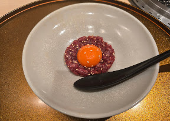
</figure>

I don't remember every single item we ate, but judging from my photos, we also had an A5 Wagyu sandwich, which was ridiculously good.

Next up, the chef started grilling various cuts of meat. I believe I tried beef tongue, along with a massive piece of Wagyu that literally melted in my mouth the moment I took a bite.

<figure>
  
</figure>

<figure>
  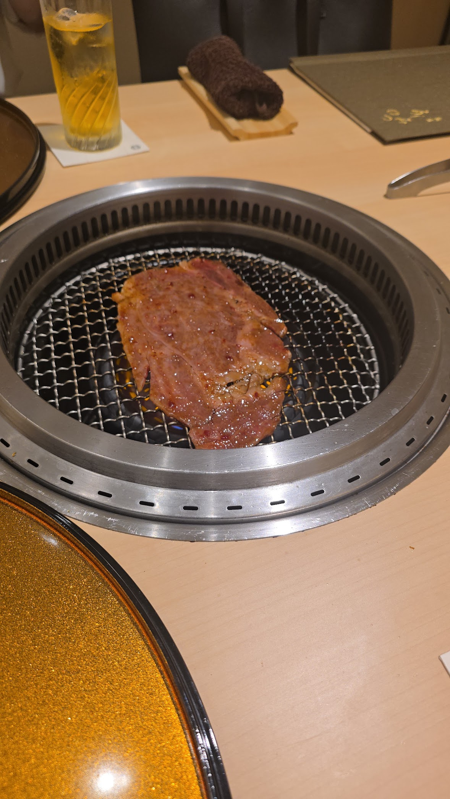
</figure>

<figure>
  
</figure>

Toward the end, we had a dish with rice, beef, and unagi (eel). The beef felt a little under-salted to me, so that one wasn't really my favorite.

<figure>
  
</figure>

For dessert, we were served a matcha wafer sandwich with vanilla ice cream inside. 

<figure>
  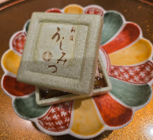
</figure>

Throughout the meal, I gave my honest reactions on camera—and I swear I wasn't overreacting! It was my first time ever being interviewed, so I was super nervous, but I tried my best to keep it natural.

Now, I'm sure you're wondering: *where is the video link?* 

It *is* on YouTube, but... I am NOT sharing it here! xD 

If you happen to stumble upon it, good for you! I have high anxiety and haven't even brought myself to watch it because I know I'll find it super weird and cringey. So yeah, if you find it on YouTube, keep it to yourself!

At the end of the shoot, I gave him a little Dodo bird souvenir as a thank you gift. He kindly paid for the entire meal which, given how fancy it was, must have been crazy expensive!

## Day 14 - Harry Potter and the Cursed Child 

Back when I was planning my itinerary, I randomly came across this online: they were performing the *Harry Potter and the Cursed Child* stage play in Tokyo! Obviously, I had to get a ticket. I booked everything online months ago back in Mauritius.

When the day finally arrived, I headed over to Akasaka where the play was being held. The train station itself is full of Harry Potter vibes, including a giant Time-Turner display, a souvenir shop, and even a themed Harry Potter Cafe! 

<figure>
  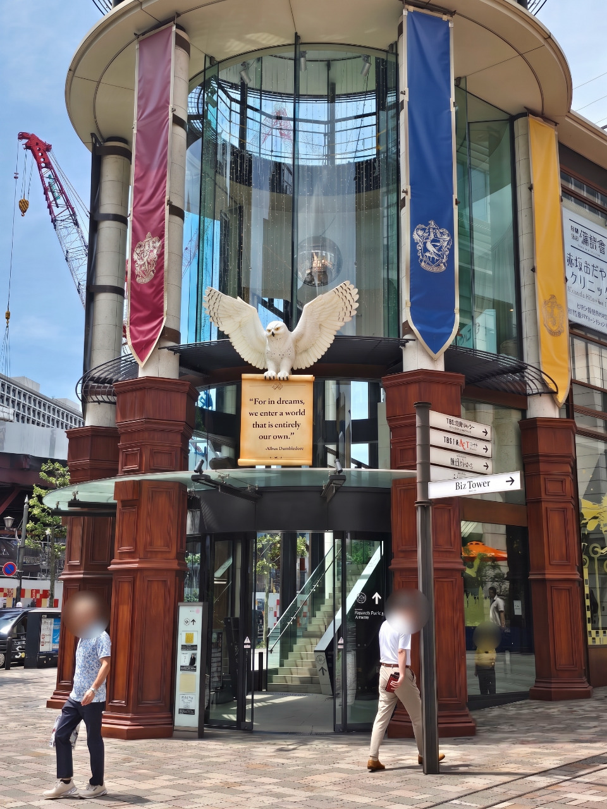
</figure>

<figure>
  
</figure>

<figure>
  
</figure>

<figure>
  
</figure>

<figure>
  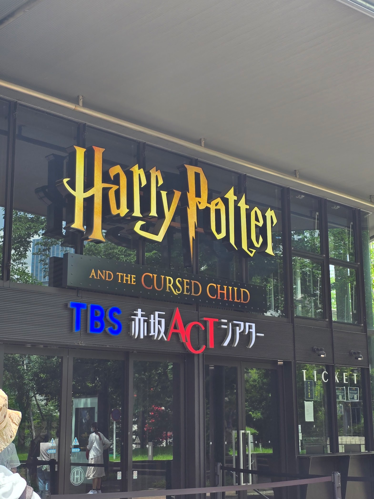
</figure>

Stupidly enough, I didn't realize until the last minute that I needed ¥10000 *in cash* as a deposit for the English subtitle device. I was literally standing in line waiting for my turn when it finally clicked! I had to sprint all the way to a nearby 7-11 five minutes away, pull out the cash, and sprint all the way back to jump into queue just in time to grab the portable screen.

## The Play 

The play itself was fantastic! Since it was performed entirely in Japanese, having the portable subtitle device was super helpful for following along. You can probably guess how amazing it was! I read the script book when it first came out years ago, so I already knew the general storyline. It started off at Platform 9¾ with Harry and Ginny seeing their kids off to Hogwarts, alongside Hermione, Ron, and their children.

<figure>
  
</figure>

<figure>
  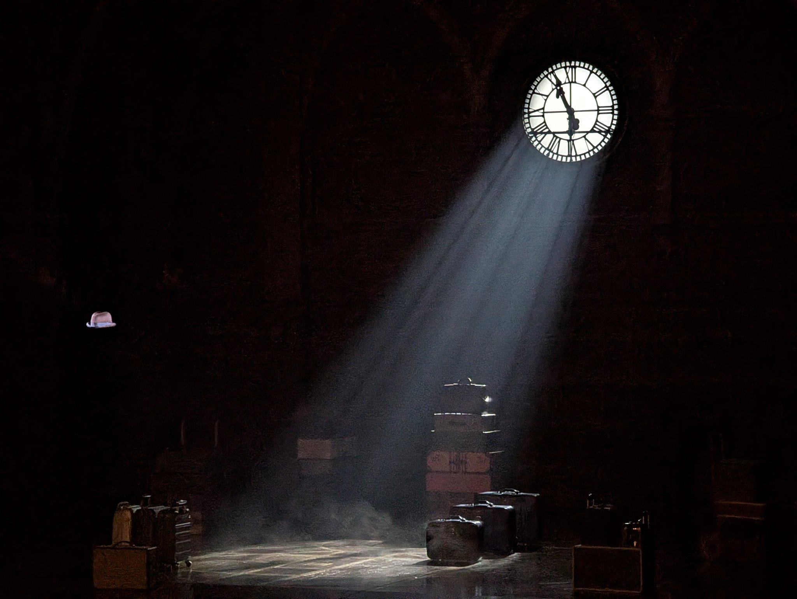
</figure>

<figure>
  
</figure>

I was completely mindblown by how synchronized the entire cast was. Words honestly can't do it justice—bloody hell, it was sublime!

If you've read the book, the stage production follows it scene for scene. Right before the interval, the Dementors appeared and were literally flying all around the entire theater. They were absolute nightmare fuel and so terrifying to see live!

Overall, the whole play ran for about 5 hours, but it was worth every single minute.

<figure>
  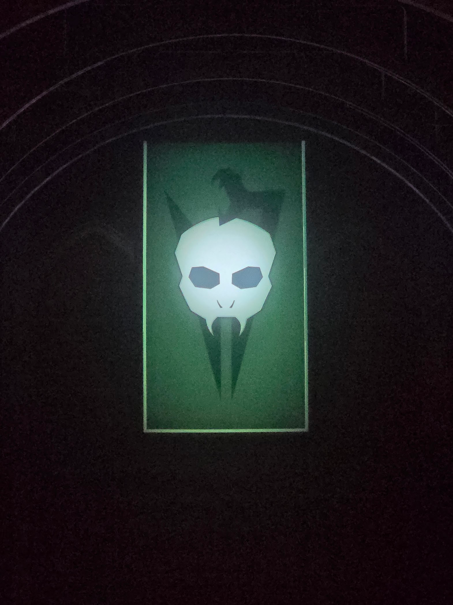
</figure>

<figure>
  
</figure>

## Day 15 - Making of Harry Potter

Head over to [insert link] to read about my Harry Potter adventure! The post was getting too long, so I had to break it down into a separate blog post.

## Day 16 - Relax Day 

On this day, I decided to take it easy. I strolled around Shinjuku and ordered myself a badminton racket. 
I missed seeing Viktor Axelsen and Kento Momota by just a couple of days, but I still got to see their signatures!

<figure>
  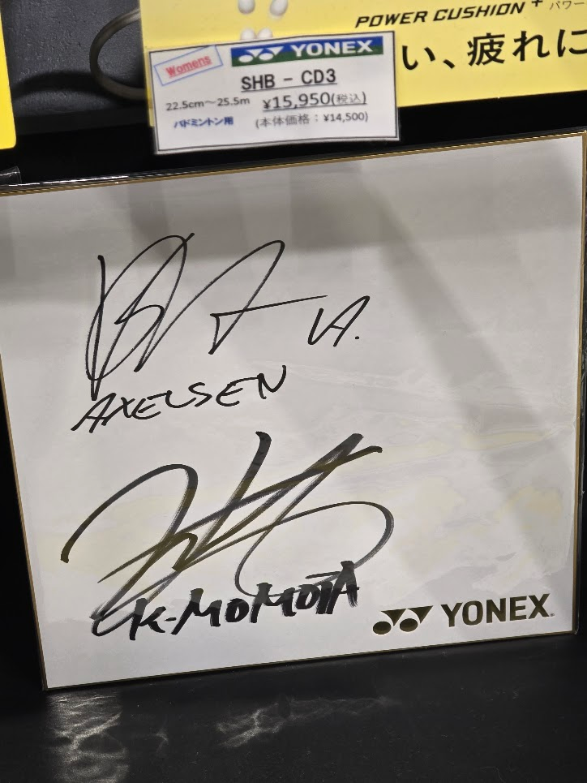
  <figcaption>Viktor Axelsen & Kento Momota Signatures</figcaption>
</figure>

Okay, I'm pretty sure you know about Onitsuka Tiger. I'm not particularly a big fan of shoes, but since they're so popular here in Japan, I decided to pick up a pair. Normally, to visit their stores across Japan, you have to get a ticket and wait anywhere from 45 minutes to 3 hours for your turn. But lucky for me, the day I was in Shinjuku, a [new store](https://www.onitsukatiger.com/jp/magazine/onitsuka-shinjuku-open/?lang=en) had just opened and it was huge! I headed inside and while it was definitely crowded I managed to squeeze in and grab myself a pair.

<figure>
  
  <figcaption>Onitsuka Tiger Shoes</figcaption>
</figure>

In the evening, I walked over to the Tokyo Metropolitan Government Building, which was about a 20mins walk from my hotel. Every night starting at 19:30, they hold a projection mapping [light show](https://tokyoprojectionmappingproject.jp/en/). The lineup featured *Bocchi the Rock!*, a song by AiNA THE END, and more!

## Day 17 - Akihabara (Part 1)

Akihabara is a place you'll love if you're a geek like me! It's packed with manga, anime, and gaming spots everywhere you look.

I arrived around noon after checking out of my hotel in Shinjuku. Since check-in at my new hotel wasn't until 3:00 PM, I went for a walk. First, I checked out Yodobashi Camera—a massive 9-story building filled with gadgets, electronics, and anime merchandise. I spent around two hours just wandering around. 

One cool thing is that they have demo stations where you can try out games for free! I played on the Nintendo Switch 2, PS4, and gaming PCs, and even tried out VR. They even had drawing tablets set up—the same kind animators use to draw anime!

Spotted a cosplayer while walking around:

<figure>
  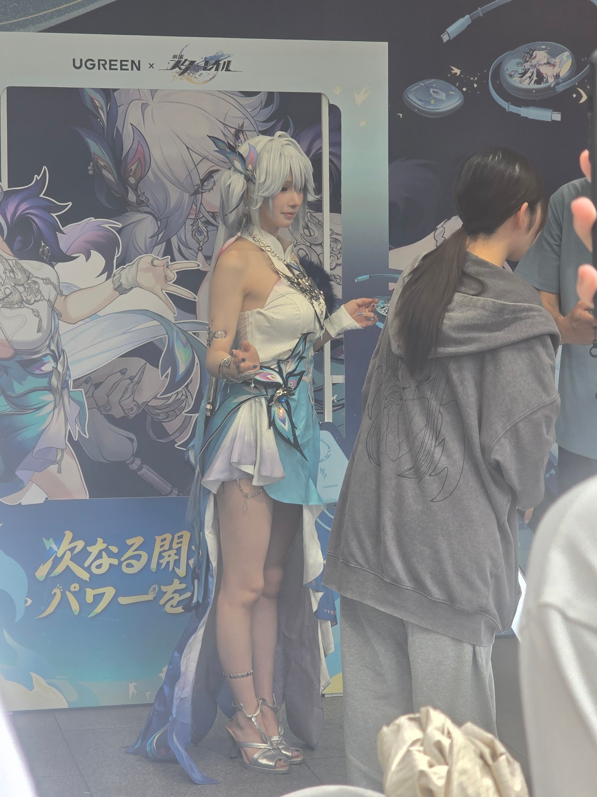
  <figcaption>Cosplayer</figcaption>
</figure>

<figure>
  
  <figcaption>Godzilla vs. King Ghidorah</figcaption>
</figure>

<figure>
  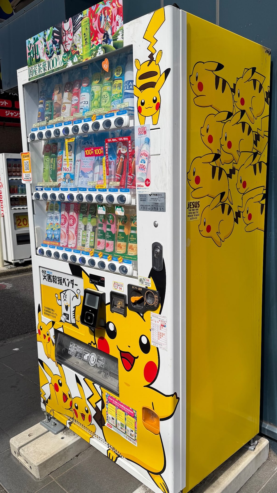
  <figcaption>Pikachu Vending Machine</figcaption>
</figure>

For lunch, I had some Tonkatsu Curry with miso soup... so good!

<figure>
  
  <figcaption>Delicious Tonkatsu Curry & Miso Soup</figcaption>
</figure>

I decided to try my luck at the game centers... and after way too many attempts (please don't ask me how much money I spent on this 💀), I **FINALLY** won a Frieren figurine! 

## Day 18 - Akihabara (Part 2)

Had a huge crush on Mai Valentine from Yu-Gi-Oh! back in the day...

<figure>
  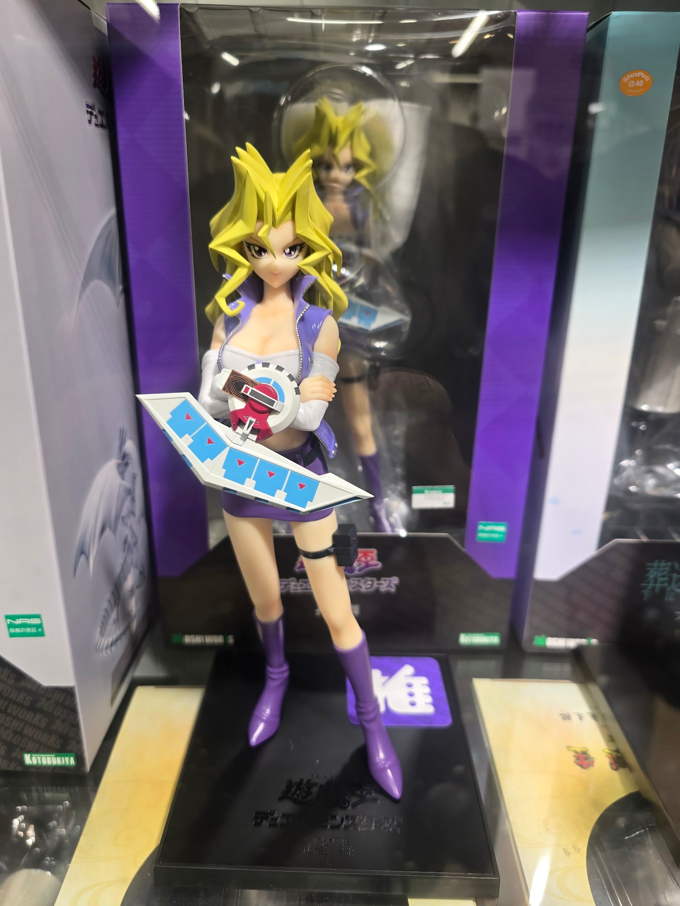
  <figcaption>Mai Valentine display</figcaption>
</figure>

FOUND ADO-CHANNN!!! 💙 Unfortunately, it was only CDs this time around!

<figure>
  
  <figcaption>Ado CDs</figcaption>
</figure>

MORE ADO-CHANNN!!!!

<figure>
  
  <figcaption>Ado display at the shop</figcaption>
</figure>

While browsing in Animate, I stumbled upon the *Your Name* light novel/manga box set in English! Bought them without hesitation—snagged all three volumes!

<figure>
  
  <figcaption>Your Name (English release)</figcaption>
</figure>

Also bought into a giant (well, not *that* giant) Luffy figure!

<figure>
  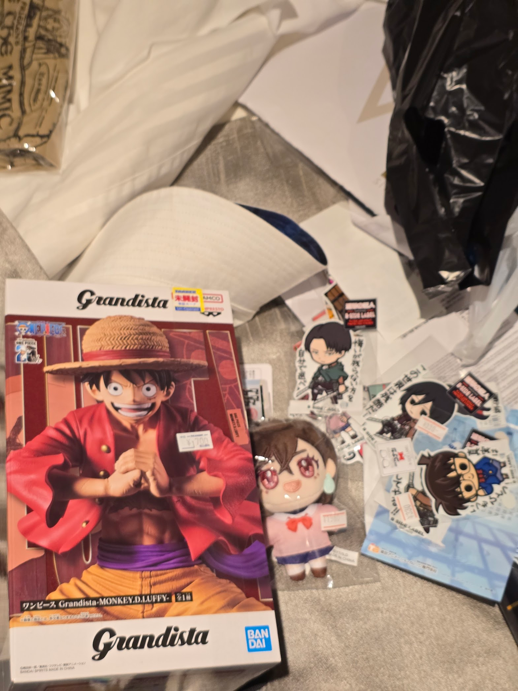
</figure>

## Day 19 - Shibuya

Ah, Shibuya—the final stop of my trip! For as long as I can remember, I've watched the [Shibuya Crossing live stream](https://www.youtube.com/watch?v=dfVK7ld38Ys&pp=ygUVc2hpYnV5YSBjcm9zc2luZyBsaXZl) on YouTube, so actually being there felt surreal. 

Honestly though, I think Shibuya Crossing is a bit overrated. Every time the pedestrian light turns green, a bunch of people rush to the middle to pose for photos—mostly influencers! With so many crowds around, I was starting to get a bit irritated (I guess that's why I travel alone! xD).

Anyway, I even took a screenshot from the YouTube live stream to see if I could spot myself in the crowd!

<figure>
  
  <figcaption>Spotting myself on the live stream!</figcaption>
</figure>

<figure>
  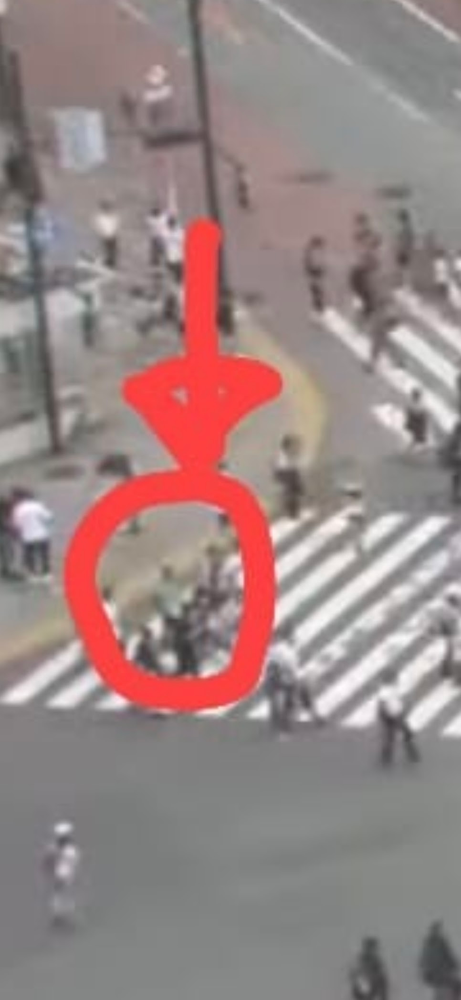
</figure>

Next, I headed to the Adidas Shibuya Store. Previously, they had a giant Ado wallpaper display set up inside, but it looks like they recently replaced it with a massive football jersey display!

Here was the original giant Ado display from before:

<figure>
  
  <figcaption>The legendary Ado display at Adidas Shibuya</figcaption>
</figure>

<figure>
  
  <figcaption>The new store setup</figcaption>
</figure>

I went inside really hoping to pick up both the white and short-sleeve Japan national team jerseys... but guess what? Sold out everywhere across Japan! What the hell?! I was so relieved I managed to snag the long-sleeve version back in Osaka.

On the way, I even ran into a [Paolo from TOKYO](https://www.youtube.com/@PaolofromTOKYO) branded vending machine! If you don't know him, he's a YouTuber I've been watching for years who makes awesome videos on Japanese food and daily life. Definitely give his channel a watch!

<figure>
  
  <figcaption>Paolo from TOKYO vending machine!</figcaption>
</figure>

## Day 20 - Ginza Uniqlo Shopping

Here is my breakfast from Lawson. Don't judge me—it was freaking good!

<figure>
  
  <figcaption>Lawson breakfast run</figcaption>
</figure>

Today, I decided to head to Ginza, home to a massive Uniqlo flagship store. 

I did *a lot* of shopping! For lunch, I checked out a local ramen spot with great reviews, and it was obviously super delicious.

<figure>
  
  <figcaption>Ramen time!</figcaption>
</figure>

I also bought a new suitcase for a decent price back in Akihabara. I ended up buying a bunch of travel stickers and started sticking them all over it!

<figure>
  
  <figcaption>Customizing the new suitcase</figcaption>
</figure>

## Day 21 - Ghibli Museum + Meiji Shrine

### Ghibli Museum

GHIBLI DAYYY!!! Finally! 

If you don't know, getting tickets for the Ghibli Museum is ridiculously hard. Tickets go on sale on the 10th of every month at 10:00 AM Japan Standard Time (JST) for the following month. For me back home in Mauritius, that meant logging on at 5:00 AM. 

For four months straight leading up to the trip, I practiced getting into the queue! I would wake up at 4:00 AM just to test my strategy so I'd be 100% prepared when the June 10th tickets (for my July visit) went live. 

My battle setup: laptop + phone, running multiple browsers, dozens of tabs, and incognito windows active simultaneously. I literally had over 100 tabs open just to beat the queue system!

Here are a few screenshots from my trial runs:

#### February 10th
<figure>
  
</figure>
 
#### March 10th
<figure>
  
</figure>
#### April 10th 
I forgot to do the trial run in April!

#### May 10th
127,237th in the queue. Bloody hell!! 

<figure>
  
</figure>

Finally, on the 10th of June, luck was on my side! Using my phone, I got placed **426th** in the queue and was finally able to secure my ticket!

<figure>
  
</figure>

The museum is located in Mitaka. On the day of the visit, I took two train lines: the Yamanote Line and the Chuo Line. From Mitaka Station, you need to catch a bus to the museum, but it's super easy to navigate thanks to clear signs in English guiding you to the bus stop. If you're lucky, you might get to ride the special yellow Ghibli Museum bus! (I wasn't so lucky, though). The total journey took around 40 minutes.

<figure>
  
</figure>

I booked the 10:00 AM entry slot. I arrived right on time, and there was already a huge queue waiting to get inside.

The museum exterior:

<figure>
  
</figure>

At the entrance, after showing your QR code, you receive some special souvenirs. I got a physical 35mm film strip ticket featuring a scene from *Ponyo*—and everyone receives a different film frame! Inside the lobby, there's even a projector setup where you can view your film strip on a backlit screen.

<figure>
  
  <figcaption>My Ponyo film strip ticket!</figcaption>
</figure>

Unfortunately, taking photos or videos inside the museum is strictly prohibited. To describe it briefly, the interior shows the magic of animation behind the scenes: zoetropes, traditional animation machinery, rooms covered wall-to-wall in concept sketches, and even a replica of Hayao Miyazaki's desk! If you're a fan of Studio Ghibli movies, definitely add this to your Japan travel plan—just make sure you prep for the ticket drop!

The souvenir shop is on the top floor. They had a lot of cool merch, though many items were a bit pricey. I ended up buying two small plushies: Totoro and a Soot Sprite.

Here is the museum seen from the outside garden area: 

<figure>
  
</figure>

<figure>
  
</figure>

<figure>
  
</figure>
On the roof garden, you'll find the life-sized statue of the Robot Soldier from *Laputa: Castle in the Sky*:

<figure>
  
  <figcaption>Robot Soldier from Castle in the Sky</figcaption>
</figure>

Nearby, you'll also find the Laputan Keystone (Control Cube) covered in ancient inscriptions from the movie:

<figure>
  
  <figcaption>The Laputan Keystone</figcaption>
</figure>

Spotted Baron and characters from *The Cat Returns* peering out through one of the windows!

<figure>
  <video src="./images/cat.mp4" controls style="width: 60%; height: auto;"></video>
</figure>

<figure>
  
  <figcaption>Characters from The Cat Returns</figcaption>
</figure>

### Meiji Shrine

After the Ghibli Museum, I took the train over to Harajuku to visit Meiji Shrine. It was freaking hot out, and I was sweating like crazy! Thankfully, the pathway leading up to the shrine is fully shaded by a dense canopy of trees.

<figure>
  
</figure>

<figure>
  
</figure>

<figure>
  
</figure>
## Day 22 - Day Out of the City: Todoroki Valley

Todoroki Ravine Park is a beautiful, quiet, and cool oasis tucked away right in Tokyo. I stumbled across this place by accident while browsing online and decided to check it out!

<figure>
  
  <figcaption>Todoroki Valley red bridge</figcaption>
</figure>

<figure>
  
</figure>

<figure>
  
</figure>

<figure style="text-align: center;">
  <video src="./images/valley.mp4" controls style="width: 60%; height: auto;"></video>
</figure>

<figure>
  
</figure>

<figure>
  
</figure>

<figure>
  
</figure>

<figure>
  
</figure>

#### Back to Shibuya

I headed back to Shibuya after spending around 2 to 3 hours wandering through the valley.

Had this for lunch:

<figure>
  
</figure>

<figure>
  
</figure>

Next, I went to the ONE PIECE Mugiwara Store!

<figure>
  
  <figcaption>Mugiwara Store entrance</figcaption>
</figure>

<figure>
  
</figure>

I WANTED ALL OF THEM!!! 🏴‍☠️

<figure>
  
  <figcaption>Must... resist... buying everything...</figcaption>
</figure>

<figure>
  
</figure>

<figure>
  
</figure>

I even got a commemorative store stamp for my logbook!

<figure>
  
  <figcaption>Mugiwara Store souvenir stamp</figcaption>
</figure>

## Day 23 - Back to Akihabara: Steins;Gate Exhibition

I headed back to Akihabara for the special *Steins;Gate* exhibition. It took me a while to locate the right building, but I eventually made it!

<figure>
  
  <figcaption>Steins;Gate Exhibition entrance</figcaption>
</figure>

<figure>
  
</figure>

<figure>
  
</figure>

## Day 24 - Relax Day - Last Day of Shopping

Back in Shibuya, a wild Reggie from JJK appeared out of nowhere! It was actually a giant, 2-meter-tall statue of him. His body was completely covered in paper receipts. If you don't know, Reggie is a character from *Jujutsu Kaisen* whose cursed technique, Contract Recreation, allows him to burn receipts to instantly manifest whatever item or service is printed on them into reality. For this event, you could actually step up and pull a receipt attached to the giant Reggie for a chance to win some amazing prizes!

<figure>
  
  <figcaption>Giant Reggie statue in Shibuya</figcaption>
</figure>

I ended up waiting in queue for about an hour just to try it out. I actually won something! It was related to *Monster Strike*, but with the massive crowd, claiming the prize meant waiting another 2 to 3 hours. I decided not to bother and just kept moving, but it was still a super cool event to stumble upon.

A long-time dream finally came true! The only downside? I had no one to do the iconic pose with on the steps xD, but it was still totally worth the visit!

<figure>
  
</figure>

<figure>
  
</figure>

## Day 25 - Daihatsu Japan Open 2026 - Tokyo Metropolitan Gymnasium

My trip to Japan wasn't originally supposed to be this long. But when I found out that the Japan Open was happening, I told myself I had to be there no matter what, so I extended my stay by another week. Luckily, I had already managed to secure a ticket to the finals back home in Mauritius.

There were so many top players I was dying to see live, like [An Se Young](https://bwfbadminton.com/player/87442/an-se-young), [Akane Yamaguchi](https://bwfbadminton.com/player/96312/akane-yamaguchi), [Chiharu Shida](https://bwfbadminton.com/player/68282/chiharu-shida), [Tomoka Miyazaki](https://bwfbadminton.com/player/82070/tomoka-miyazaki), etc. Unfortunately, Se-young had to withdraw due to injury, Shida didn't participate, and Miyazaki lost in the first round. However, Yamaguchi made it all the way to the final, and I was beyond excited to watch her!

I arrived around 10:30 AM, and the venue was already packed with fans.

<figure>
  
</figure>

<figure>
  
</figure>

<figure>
  
</figure>

View from my seat:

<figure style="text-align: center;">
  <video src="./images/bad1.mp4" controls style="width: 60%; height: auto;"></video>
</figure>

A hand fan featuring signatures from the Japanese national team players!

<figure style="text-align: center;">
  <video src="./images/bad2.mp4" controls style="width: 60%; height: auto;"></video>
</figure>

#### Mixed Doubles

First up was the Mixed Doubles final featuring China vs. Chinese Taipei.

The match was won by the Chinese pair after a thrilling 3-set rally. Superb match!

<figure style="text-align: center;">
  <video src="./images/bad3.mp4" controls style="width: 60%; height: auto;"></video>
</figure>

#### Women's Singles

Next up was the Women's Singles! I’ve been a massive fan of Akane Yamaguchi for a long time and have watched almost every single one of her matches live on the [BWF channel](https://www.youtube.com/@BWF). Finally getting to see her play in person meant the world to me.

Her opponent was [Pusarla V. Sindhu](https://bwfbadminton.com/player/73173/pusarla-v-sindhu).

<figure style="text-align: center;">
  <video src="./images/bad4.mp4" controls style="width: 60%; height: auto;"></video>
</figure>

The atmosphere inside the stadium was unbelievable.

Unfortunately, Akane didn't manage to pull off the win, but Sindhu’s play was incredibly sharp and aggressive. She took the match in two straight sets.

#### Men's Singles

Next was [Christo Popov](https://bwfbadminton.com/player/72885/christo-popov) vs. [Koki Watanabe](https://bwfbadminton.com/player/97174/koki-watanabe).

Another brilliant match! Popov was in peak form and closed it out in two sets.

#### Women's Doubles

Women's Doubles featured the Korean pair [Kim Hye Jeong](https://bwfbadminton.com/player/83419/kim-hye-jeong) and [Kong Hee Yong](https://bwfbadminton.com/player/71391/kong-hee-yong) vs. the Chinese pair [Zhang Shu Xian](https://bwfbadminton.com/player/85914/zhang-shu-xian) and [Jia Yi Fan](https://bwfbadminton.com/player/65144/jia-yi-fan).

This match went to a deciding third set, and honest to God, we were treated to absolute peak badminton.

The third set went deep into extra points: 20-20, 21-20, 21-21... all the way up to 26-26, 27-27!

The photographers courtside added so much unintentional comedy to the moment. Every time the Korean pair held match point, all the photographers would shuffle back and forth (*aller-retour*) to focus on them, and the second the Chinese pair pulled ahead, they’d all hurry back to the other side to cover them instead. Watching them switch back and forth on every single point was hilarious!

The match finally reached the ultimate sudden-death point at 29-29! On the final rally, Zhang Shu Xian hit a shot over the baseline; she initially thought she won the match, while the Korean pair immediately celebrated, knowing it was out. Absolute drama until the very last second! China called for a Hawk-Eye challenge, but the review confirmed the shuttle was out, handing the victory to the Korean pair.

What a match! If you want to watch the full replay, [here's the link](https://www.youtube.com/watch?v=HycCF1t6kxg).

<figure style="text-align: center;">
  <video src="./images/bad5.mp4" controls style="width: 60%; height: auto;"></video>
</figure>

<figure style="text-align: center;">
  <video src="./images/bad6.mp4" controls style="width: 60%; height: auto;"></video>
</figure>

<figure>
  
</figure>

<figure style="text-align: center;">
  <video src="./images/bad7.mp4" controls style="width: 60%; height: auto;"></video>
</figure>

<figure>
  
</figure>

#### Men's Doubles

Finally, we had the Men's Doubles final featuring Indonesia's [Fajar Alfian](https://bwfbadminton.com/player/88876/fajar-alfian) and [Muhammad Shohibul Fikri](https://bwfbadminton.com/player/91440/muhammad-shohibul-fikri) against the world number one Korean pair, [Kim Won Ho](https://bwfbadminton.com/player/61444/kim-won-ho) and [Seo Seung Jae](https://bwfbadminton.com/player/66513/seo-seung-jae).

It was another superb match! Most people expected the top-ranked Korean pair to take the title, but the Indonesian duo played insanely well and pulled off an incredible upset, winning in straight sets.

## Day 26 - Final Day

Ahhh... why can't we have unlimited happiness? 😭

On my final day, I booked a taxi to drive me to the station for the Limousine Bus to Narita Airport. Technically, the bus stop was only about a 5min walk from my hotel, but it involved going down a set of stairs. Since I was hauling two huge pieces of luggage plus a massive backpack, I decided to take a taxi instead. It ended up being a quick 3min drive 😂, but I still paid 1,000 yen!

I arrived at the stop, waited about an hour for the bus, and then headed off to the airport.

This was the moment where I nearly cried... Honestly, Japan was so amazing. How I wish I lived here

<figure style="text-align: center;">
  <video src="./images/v19.mp4" controls style="width: 60%; height: auto;"></video>
</figure>

## Day 27 - Layover in Malaysia

Well... back in Malaysia. Everything felt so noisy and chaotic, and I was getting irritated by every little thing after leaving Japan!

I landed in Malaysia around midnight, and my connecting flight wasn't for another 12 hours (at 12:50 PM). 

I booked a capsule hotel right at the airport to get some sleep, refreshed myself, and then caught my flight back home.

Saying goodbye to Japan was so hard, but this trip was everything I could have wished for and more. The countdown to the next trip starts now! 🎌