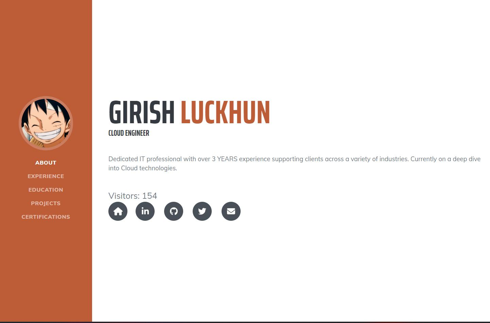

As a Cloud Engineer, acquiring new cloud skills has become essential. I explored various avenues for learning, including enrolling in free online courses, watching informative videos, and attending insightful presentations. However, I realized that while I had grasped certain concepts, there was still a gap in my practical understanding of cloud technologies. The question lingered: if tasked with migrating an existing application to the cloud, would I truly be prepared?

The [Cloud Resume Challenge](https://cloudresumechallenge.dev/docs/the-challenge/) is great as not only am I applying what I've learned but I am also learning new skills and concepts such as JavaScript, html, etc. Its also making me use AWS tools and get familiar with how they work as well as the errors and problems that can occur while using them.

## Cloud Resume Challenge basics
The challenge is to build a static website on the cloud provider of your choice to host your resume along with a visitor counter. Sounds pretty simple right? So I thought! can you paraphrse. The intent is to build many of the skills and use technologies that Cloud Engineers use on a day-to-day basis. I chose AWS as the cloud provider where will be deploying my static website and infrastructure. 

## Certification

Although not necessary to have the certification to start the project, it seems having it would be required to finish, so this step was already finished for me as I found this challenge after getting my certification.

## HTML/CSS

In this step I was required to create a resume website using HTML as well as style it with CSS. It was quite fun relearning HTML as well as getting a better understanding of it as well as how to use CSS. After all was done I got done with my first ever resume webpage!

## Static S3 Website, HTTPS, and DNS

This portion of the challenge wasn't too difficult. Getting the website up and running was relatively straightforward and simple. Firstly, I created an S3 bucket in my AWS account to store the webpage files. Once that was done, I ensured that the S3 bucket had the proper bucket policy in place to enable webpage access. I then proceeded to address the HTTPS requirement. Unfortunately, during that time, when I created my S3 bucket in the US East (N. Virginia) region, there was an [AWS outage](https://health.aws.amazon.com/health/status). As a result, I had to recreate my bucket and select a different region.

To validate the certificate for the subdomain resume.girishluckhun.com, I followed the validation process specified by AWS. This typically involves adding a specific CNAME record to the DNS configuration of the domain.

By adding the CNAME record to the DNS configuration, I allowed AWS to verify the ownership of the domain and validate the certificate request. This validation step ensures that the SSL/TLS certificate issued for resume.girishluckhun.com is trusted and recognized by web browsers, enabling secure HTTPS connections to my website.

## AWS Lambda, DynamoDB and JavaScript counter

To enable the visitor counter functionality, I implemented the required backend infrastructure and logic. Firstly, I created a basic DynamoDB table with a single item dedicated to storing and updating the visitor count. This table serves as the central data storage for the visitor counter feature. Next I worked on the Lamba function using Python to retrieve and update the count in the database table I made.

During my testing phase, I encountered a cache issue that prevented the view count from appearing on the website. After some googling, I stumbled upon a [helpful resource](https://www.simplified.guide/aws/cloudfront/invalidate-cache). This action ensures that the latest version of the objects, including the view count, is fetched from the origin server and displayed correctly on the website. By implementing the cache invalidation process, I successfully resolved the cache issue and ensured that the view count was accurately displayed to website visitors.

## Conclusion
The Cloud Resume Challenge has been an invaluable learning experience for me. It provided an opportunity to apply and expand my knowledge of cloud technologies, including HTML/CSS, AWS services, and backend logic with Lambda and DynamoDB. I encountered challenges along the way, such as DNS validation, cache issues, and infrastructure setup, but I was able to overcome them through research and problem-solving. In addition, it is a great way to build your resume and show potential employers your skills in action. Thanks Forrest!

Try the challenge yourself! - [Cloud Resume Challenge](https://cloudresumechallenge.dev/docs/the-challenge/)