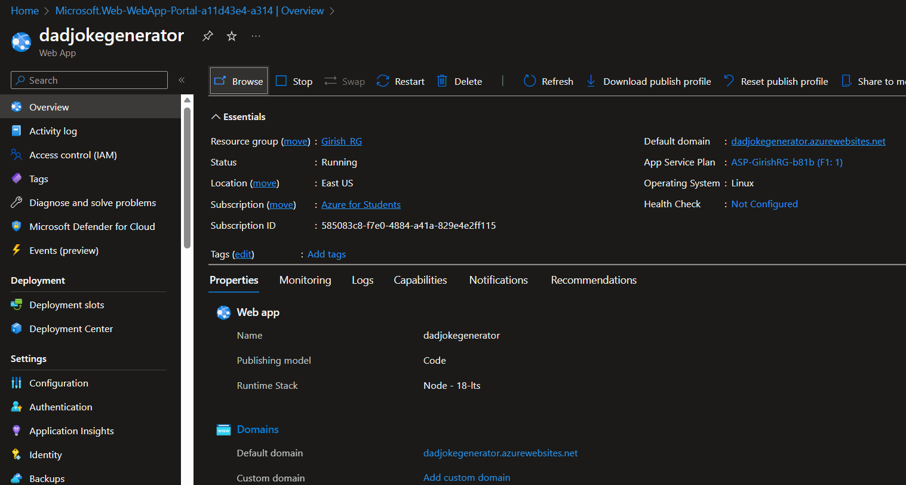
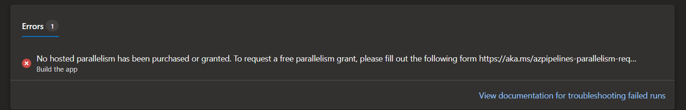

Recently, I had the opportunity to work on a project that utilized an [Azure DevOps build pipeline](https://learn.microsoft.com/en-us/azure/devops/pipelines/?view=azure-devops) to deploy an [app service](https://learn.microsoft.com/en-us/azure/app-service/overview). Lately, I've been focusing more on AWS, but I couldn't pass up this chance to learn new things from Azure.

Since I don't have a personal Azure Account, and Azure doesn't accept Visa cards during registration, I had to explore alternative solutions. Fortunately, I discovered that university students could create free accounts using their email addresses without the requirement of adding any credit card information.   More details can be found [here](https://azure.microsoft.com/en-us/free/students). Luckily, I had a friend who was in her third year at UOM, and with her kind assistance, I managed to overcome this hurdle 😅.
Thanks [Divya](https://mu.linkedin.com/in/divya-rampersad-328a10231).

## What is an Web App?

In case you're new to Azure, [Microsoft Azure App Service](https://learn.microsoft.com/en-us/azure/app-service/overview) offers a fully managed platform designed to facilitate the building, deployment, and scaling of web apps. As a Platform as a Service (PaaS), it eliminates the need to worry about infrastructure and performance, allowing quick and seamless app deployment. With support for various programming languages, including .NET, .NET Core, Java, Ruby, Node.js, PHP, and Python, developers can work with their preferred language. The flexibility extends to both Windows and Linux-based environments, enabling easy running and scaling of applications.

Azure App Service goes beyond providing the capabilities of Microsoft Azure, incorporating features such as security, load balancing, autoscaling, and automated management into your application. Additionally, it leverages the DevOps capabilities, including continuous deployment from Azure DevOps, to further streamline the development process.

### What is Azure Devops?

[Azure Devops](https://learn.microsoft.com/en-us/azure/devops/get-started/?view=azure-devops) is a comprehensive set of development and collaboration tools provided by Microsoft as a part of the Azure cloud platform. It offers a range of services to facilitate application development, continuous integration, continuous delivery (CI/CD), and project management. Azure DevOps is designed to streamline the entire software development lifecycle, from planning and coding to testing, deployment, and monitoring.

Okay, so enough of the boring part and lets get our hand dirty.

## Node.js application

Given that I'm still learning Node.js, I asked ChatGPT to write a simple and easy-to-understand Node.js app for me. I went for a Dad joke generator app because why not? The code was tested and works locally. Now, let's hope it works when it is added to the cloud. The code can be found on my [GitHub repository](https://github.com/RitLuck/Dad_joke).


## Creating App Service

1. Go to the Azure portal, search for App service and create a new Web app
2. Fill in the information by adding : 
    - Select your Subscription(mine is Azure for Students)
    - Choose Resource Group (if you don’t have one, you can click create new and specify the name).
    - Name of the Web App
    - Runtime stack. Specify the app service language. In this example, I chose Node 18 LTS.
    - OS (I Chose Linux)
    - Region (East US by default)
    - Pricing Plan (Free F1, because this is just for demo purposes)

    

3. The remaining configurations can be left as default. 
4. Click Review + Create button, and wait until the app is deployed successfully.

    

5. Go to your resource and click the URL to ensure your app is running.

    

## Creating Service Principle

Since we're on the Azure Portal, let's create an App Registration because we don't want to encounter any errors later when trying to establish the service connection (been there).

1. Go to Active Directory
2. Click on App registrations

    

3. Once created, go the **Certificates & Secrets** and create a Secret. Make sure to store the Secret Value somewhere.

    

## Creating Devops Environment
1. To create an azure devOps, head over to this [url](https://azure.microsoft.com/en-us/pricing/details/devops/azure-devops-services/) 

2. On the right-hand side, under Basic Plan, click the "Start Free" button. 

    

3. Create your Azure DevOps organization. Click the "Continue" button.

4. Once your DevOps environment is set, you can add your code to Azure Repos or directly use your code from GitHub/Git.

### Setting up the service connection

#### Why do we need to create a service connection?
A service connection is used to establish a connection between Azure DevOps and external services, such as Azure, GitHub, Docker Hub, etc. These connections allow Azure DevOps pipelines and other automation tasks to interact with these external services seamlessly.

1. Go to **Project Settings** on Azure DevOps.
2. Select "**Service Connections**" and Create a **new service connection**
3. Select **Azure Resource Manager** and **Service principle (manual)**
4. Fill in all the required informations 
    - Subscription Id
    - Susbscription Name
    - Service Principle Id (This will be the Client ID of the App registration you created earlier)
    - Service principle key (The value you saved earlier)
    - Tenant Id 
    - Service Connection name (Any name you want)
    - Select **Grant access permission to all pipelines**

5. Once everything is filled out, click and verify; it should appear as succeeded. If not, you might have a permission issue.


### Fixing service connection issue

In case you're getting this issue, which I'm quite certain you're getting 🥹. Then fear not.

**"Failed to query service connection API "https://managemant.azure.com/sub/xxx?api-version=2016-06-01.status code:'status code:{"error",:{code""Authorization failed message" 'the client" with object id "does not have authorization to perform action 'microsoft.resource/sub/read,over scope'/sub or scope is invalid.if access was recently granted.please refresh your credentials}}"**


To resolve the error, assign the reader role/permission to the Azure AD Application on the subscription level.

1. Go to your **subscription**
2. Click on **Access control(IAM)**
3. Click on **Add Role Assignment**
4. Choose the **Reader or Contributor** Role
5. Click on **Select Members** and choose your app registration.

    

After giving your app registration access, check your service connection again, and it should appear as Succeeded.


### Building our pipeline

To create the pipeline based on the Node.js node, proceed as follows:

1. Click on **Pipelines** and **Create New Pipeline**
2. It should say **"Where is your code?"**. Since I added mine on Azure Repos, I chose Azure Repos Git.
3. Select your repository.
4. Configure your pipeline. I'm using **Node.Js**, so I'm choosing **Node.js**
5. Review the default pipeline and Save.
6. The default pipeline will be as follows : 

    

7. We'll add our own yaml line

    ```
    # Define the trigger configuration for the pipeline
    # This pipeline will be triggered when changes are pushed to the "devops" branch
    trigger:
    branches:
        include:
        - devops   # Replace with your main branch name

    # Define the jobs that will be executed in the pipeline
    jobs:
    - job: Build
    displayName: 'Build the app'
    pool:
        vmImage: 'ubuntu-latest'
    steps:
    # Use the NodeTool task to install Node.js version 18.x
    - task: NodeTool@0
        inputs:
        versionSpec: '18.x'
        displayName: 'Install Node.js'

    # Run 'npm install' to install the project dependencies
    - script: |
        npm install
        displayName: 'Install dependencies'

    # Display the contents of the default working directory for debugging purposes
    - script: |
        echo "Contents of the default working directory:"
        ls $(System.DefaultWorkingDirectory)
        displayName: 'List files in working directory'

    # Archive the build output into a ZIP file
    - task: ArchiveFiles@2
        inputs:
        rootFolderOrFile: '$(System.DefaultWorkingDirectory)' # Change this if your build output is in a different folder
        includeRootFolder: false
        archiveType: 'zip'
        archiveFile: '$(Build.ArtifactStagingDirectory)/app.zip'

    # Publish the ZIP file as an artifact named "drop" for deployment
    - publish: $(Build.ArtifactStagingDirectory)/app.zip
        artifact: drop

    # Define the "Deploy" job, which depends on the successful completion of the "Build" job
    - job: Deploy
    displayName: 'Deploy to Azure Web App'
    dependsOn: Build
    pool:
        vmImage: 'ubuntu-latest'
    steps:
    # Download the artifact "drop" from the "Build" job for deployment
    - download: current
        artifact: drop

    # Use the AzureWebApp task to deploy the application to an Azure Web App
    - task: AzureWebApp@1
        inputs:
        azureSubscription: 'GLU Azure Web App'
        appType: 'webAppLinux'
        AppName: 'dadjokegenerator'
        deployToSlotOrASE: true
        ResourceGroupName: 'Girish_RG'
        SlotName: 'production'
        package: '$(System.DefaultWorkingDirectory)/**/*.zip'
        RuntimeStack: 'NODE|18-lts'
        StartupCommand: 'apt-get update -yy && node app.js'

    ```

8. Let's try to run the pipeline. The following error will be indicated 
    ```
    ##[error]No hosted parallelism has been purchased or granted. To request a free parallelism grant, please fill out the following form https://aka.ms/azpipelines-parallelism-request
    ```

    

    Reason why we get this error is Microsoft has currently suspended the free grant of parallel jobs for public projects and some private projects in newly created organizations. However, you have the option to request this grant by submitting a request. This change does not impact existing organizations and projects. Please be aware that it may take 2-3 business days for Microsoft to respond to your request for the free tier. https://learn.microsoft.com/en-us/azure/devops/pipelines/licensing/concurrent-jobs?view=azure-devops&tabs=ms-hosted

    Now if you're impatient like me and want to see the code being deployed asap then there is a workaround.

#### Creating your own agent.

Having an understanding of Agent Pools is essential. In Azure DevOps service, Agents are required to build or run your code in build pipelines. When executing a job within a build, the Agent in the Agent Pool facilitates the process.

To access Agent Pools, navigate to project settings and click on 'Agent Pools.' By default, there are two pools that exist.

-  **Azure Pipelines hosted pool**,(Each time you run a pipeline, you get a fresh virtual machine.)

You can manage these pools in Azure DevOps Yaml file as well. Read more [here](https://docs.microsoft.com/en-us/azure/devops/pipelines/agents/hosted?view=azure-devops)

-  **Default Pool** — Use it to register self hosted agents that you can setup. You have to manage on your own.


We will use the Default Pool to register our self hosted agents.

1. Click on **Default Pool** and **New Agent**
2. Follow the steps shown on the screen

    

3. Make sure you generate Access Token(PAT) beforehand. It is available in your profile settings.

    

4. Now move to the machine or system which is going to work. Install it using instructions given by Microsoft. While running it you have to provide few details so that it can configure itself.

5. Once you run the agent, check the status in Azure Console.

    

Now that the agent is set up, Let's proceed to add it on our pipeline.

### Deploying the Web app via Azure Devops

1. First, let's change our agent pool. 

    Change Line 10 and 40 to ```name: default```

2. So, the final yaml file will be like this : 

    ```
    # Define the trigger configuration for the pipeline
    # This pipeline will be triggered when changes are pushed to the "devops" branch
    trigger:
    branches:
        include:
        - devops   # Replace with your main branch name

    # Define the jobs that will be executed in the pipeline
    jobs:
    - job: Build
    displayName: 'Build the app'
    pool:
        name: default
    steps:
    # Use the NodeTool task to install Node.js version 18.x
    - task: NodeTool@0
        inputs:
        versionSpec: '18.x'
        displayName: 'Install Node.js'

    # Run 'npm install' to install the project dependencies
    - script: |
        npm install
        displayName: 'Install dependencies'

    # Display the contents of the default working directory for debugging purposes
    - script: |
        echo "Contents of the default working directory:"
        ls $(System.DefaultWorkingDirectory)
        displayName: 'List files in working directory'

    # Archive the build output into a ZIP file
    - task: ArchiveFiles@2
        inputs:
        rootFolderOrFile: '$(System.DefaultWorkingDirectory)' # Change this if your build output is in a different folder
        includeRootFolder: false
        archiveType: 'zip'
        archiveFile: '$(Build.ArtifactStagingDirectory)/app.zip'

    # Publish the ZIP file as an artifact named "drop" for deployment
    - publish: $(Build.ArtifactStagingDirectory)/app.zip
        artifact: drop

    # Define the "Deploy" job, which depends on the successful completion of the "Build" job
    - job: Deploy
    displayName: 'Deploy to Azure Web App'
    dependsOn: Build
    pool:
        name: default
    steps:
    # Download the artifact "drop" from the "Build" job for deployment
    - download: current
        artifact: drop

    # Use the AzureWebApp task to deploy the application to an Azure Web App
    - task: AzureWebApp@1
        inputs:
        azureSubscription: 'GLU Azure Web App'
        appType: 'webAppLinux'
        AppName: 'dadjokegenerator'
        deployToSlotOrASE: true
        ResourceGroupName: 'Girish_RG'
        SlotName: 'production'
        package: '$(System.DefaultWorkingDirectory)/**/*.zip'
        RuntimeStack: 'NODE|18-lts'
        StartupCommand: 'apt-get update -yy && node app.js'

    ```

3. Now, Let's run the pipeline again.

4. The pipeline has been built and deployed successfully. Thank you [Zain](https://zain.mu/) for helping me with the StartupCommand. 🤝

    

5. Try to access the URL again.

    


## Conclusion 

So, despite my preference for AWS, I had a pretty good experience with Azure. I learned how to deploy a web app using Azure DevOps and Azure App Service, and thanks to ChatGPT for helping me with the Node.js App. I'll try to dive a bit more into Node.js (if I have time 🥲).

Now, you might be wondering why I did all these steps manually. Well, the truth is, I was learning just like you are right now 😌. And guess what? Yes, they can be automated using something called [Terraform](https://www.terraform.io/). In the next blog post, I'll show how we can make all of this happen automatically using Terraform, and let's hope it works smoothly 😅.


