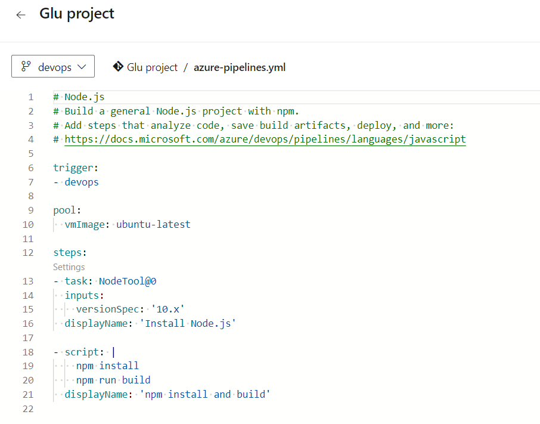

Recently, I had the opportunity to work on a project that utilized an [Azure DevOps build pipeline](https://learn.microsoft.com/en-us/azure/devops/pipelines/?view=azure-devops) to deploy an [app service](https://learn.microsoft.com/en-us/azure/app-service/overview). Even though I don't really like Azure and am trying to focus more on AWS, I couldn't pass up the chance to learn new things. 

Since I didn't have a personal Azure Account, and Azure doesn't accept Visa cards during registration, I had to explore alternative solutions. Fortunately, I discovered that university students could create free accounts using their email addresses without the requirement of adding any credit card information.   More details can be found [here](https://azure.microsoft.com/en-us/free/students). Luckily, I had a friend who was in her third year at UOM, and with her kind assistance, I managed to overcome this hurdle 😅.
Thanks [Divya](https://mu.linkedin.com/in/divya-rampersad-328a10231).

## What is an Web App

In case you're new to Azure, [Microsoft Azure App Service](https://learn.microsoft.com/en-us/azure/app-service/overview) offers a fully managed platform designed to facilitate the building, deployment, and scaling of web apps. As a Platform as a Service (PaaS), it eliminates the need to worry about infrastructure and performance, allowing quick and seamless app deployment. With support for various programming languages, including .NET, .NET Core, Java, Ruby, Node.js, PHP, and Python, developers can work with their preferred language. The flexibility extends to both Windows and Linux-based environments, enabling easy running and scaling of applications.

Azure App Service goes beyond providing the capabilities of Microsoft Azure, incorporating features such as security, load balancing, autoscaling, and automated management into your application. Additionally, it leverages the DevOps capabilities, including continuous deployment from Azure DevOps, to further streamline the development process.

### What is Azure Devops

[Azure Devops](https://learn.microsoft.com/en-us/azure/devops/get-started/?view=azure-devops) is a comprehensive set of development and collaboration tools provided by Microsoft as a part of the Azure cloud platform. It offers a range of services to facilitate application development, continuous integration, continuous delivery (CI/CD), and project management. Azure DevOps is designed to streamline the entire software development lifecycle, from planning and coding to testing, deployment, and monitoring.

Okay, so enough of the boring part and lets get our hand dirty.

## Node.js application

Given that I'm still learning Node.js, I asked ChatGPT to write a simple and easy-to-understand Node.js app for me. I went for a Dad joke generator app because why not? The code was tested and works locally. Now, let's hope it works when it is added to the cloud. The code can be found on my GitHub repository.

## Creating App Service

1. Go to the Azure portal, search for App service and create a new Web app
2. Fill in the information by adding : 
    - Select your Subscription(mine is Azure for Students)
    - Choose Resource Group (if you don’t have one, you can click create new and specify the name).
    - Name of the Web App
    - Runtime stack. Specify the app service language. In this example, I chose Node 18 LTS.
    - OS (I Chose Linux)
    - Region (East US by default)
    - Princing Plan (Free F1, because this is just for demo purposes)

    

3. The remaining configurations can be left as default. 
4. Click Review + Create button, and wait until the app is deployed successfully.

    

5. Go to your resource and click the URL to ensure your app is running.

    

## Creating Service Principle

Since we're on the Azure Portal, let's create an App Registration because we don't want to encounter any errors later when trying to establish the service connection (been there).

1. Go to Active Directory
2. Click on App registrations

    

3. Once created, go the **Certificates & Secrets** and create a Secret. Make sure to store the Secret Value somewhere.

    

## Creating Devops Environment
1. To create an azure devOps, head over to this [url](https://azure.microsoft.com/en-us/pricing/details/devops/azure-devops-services/) 

2. On the right-hand side, under Basic Plan, click the "Start Free" button. 

    

3. Create your Azure DevOps organization. Click the "Continue" button.

4. Once your DevOps environment is set, you can add your code to Azure Repos or directly use your code from GitHub/Git.

### Setting up the service connection

#### Why do we need to create a service connection?
A service connection is used to establish a connection between Azure DevOps and external services, such as Azure, GitHub, Docker Hub, etc. These connections allow Azure DevOps pipelines and other automation tasks to interact with these external services seamlessly.

1. Go to **Project Settings** on Azure DevOps.
2. Select "**Service Connections**" and Create a **new service connection**
3. Select **Azure Resource Manager** and **Service principle (manual)**
4. Fill in all the required informations 
    - Subscription Id
    - Susbscription Name
    - Service Principle Id (This will be the Client ID of the App registration you created earlier)
    - Service principle key (The value you saved earlier)
    - Tenant Id 
    - Service Connection name (Any name you want)
    - Select **Grant access permission to all pipelines**

5. Once everything is filled out, click and verify; it should appear as succeeded. If not, you might have a permission issue.

### Fixing service connection issue

In case you're getting this issue, which I'm quite certain you're getting xD. Then fear not.

**"Failed to query service connection API "https://managemant.azure.com/sub/xxx?api-version=2016-06-01.status code:'status code:{"error",:{code""Authorization failed message" 'the client" with object id "does not have authorization to perform action 'microsoft.resource/sub/read,over scope'/sub or scope is invalid.if access was recently granted.please refresh your credentials}}"**

To resolve the error, assign the reader role/permission to the Azure AD Application on the subscription level.

1. Go to your **subscription**
2. Click on **Access control(IAM)**
3. Click on **Add Role Assignment**
4. Choose the **Reader or Contributor** Role
5. Click on **Select Members** and choose your app registration.

    

After giving your app registration access, check your service connection again, and it should appear as Succeeded.

### Building our pipeline

To create the pipeline based on the Node.js node, proceed as follows:

1. Click on **Pipelines** and **Create New Pipeline**
2. It should say **"Where is your code?"**. Since I added mine on Azure Repos, I chose Azure Repos Git.
3. Select your repository.
4. Configure your pipeline. I'm using **Node.Js**, so I'm choosing **Node.js**
5. Review the default pipeline and Save.
6. The default pipeline will be as follows : 

    

7. Now let's run out own pipeline 