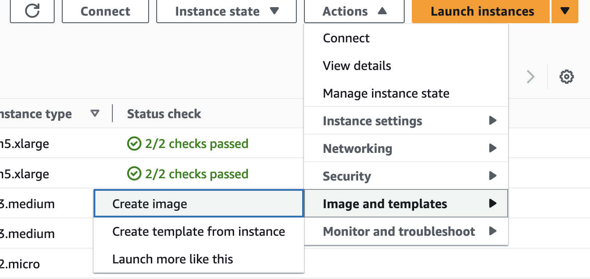
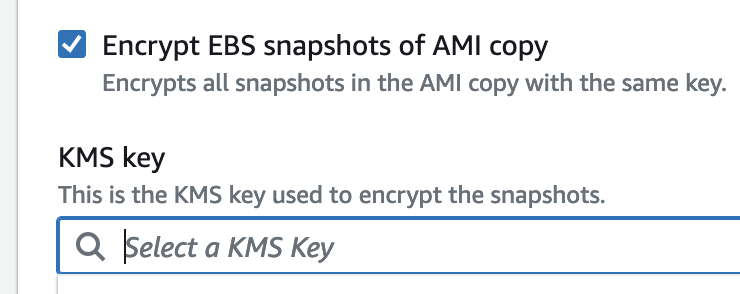

## Create an Image for the VM you want to copy

1. Select your vm.
2. Click on **Actions** -> **Image and templates** -> **Create Image**.
   

## Create an KMS key to the account

1. Go to the account where the AMI will be copied.
2. Go to **Key Management Service (KMS)**
3. Click on **Create A key**.
4. Skip all the steps and go directly to **Review**.
5. Copy and paste the following policy in the **Key Policy** section.
   
   ```
   {
    "Version": "2012-10-17",
    "Id": "key-consolepolicy-3",
    "Statement": [
        {
            "Sid": "Enable IAM User Permissions",
            "Effect": "Allow",
            "Principal": {
                "AWS": "arn:aws:iam::ACCOUNT_ID:root"
            },
            "Action": "kms:*",
            "Resource": "*"
        },
        {
            "Sid": "Allow access for Key Administrators",
            "Effect": "Allow",
            "Principal": {
                "AWS": "arn:aws:iam::ACCOUNT_ID:root"
            },
            "Action": [
                "kms:Create*",
                "kms:Describe*",
                "kms:Enable*",
                "kms:List*",
                "kms:Put*",
                "kms:Update*",
                "kms:Revoke*",
                "kms:Disable*",
                "kms:Get*",
                "kms:Delete*",
                "kms:TagResource",
                "kms:UntagResource",
                "kms:ScheduleKeyDeletion",
                "kms:CancelKeyDeletion",
                "kms:RotateKeyOnDemand"
            ],
            "Resource": "*"
        },
        {
            "Sid": "Allow use of the KMS key for organization",
            "Effect": "Allow",
            "Principal": {
                "AWS": "*"
            },
            "Action": [
                "kms:Encrypt",
                "kms:Decrypt",
                "kms:ReEncrypt*",
                "kms:GenerateDataKey*",
                "kms:DescribeKey",
                "kms:GetKeyPolicy",
                "kms:ListKeys",
                "kms:ListAliases",
                "kms:CreateGrant"
            ],
            "Resource": "*"
        },
        {
            "Sid": "Allow attachment of persistent resources",
            "Effect": "Allow",
            "Principal": {
                "AWS": "AWS": "arn:aws:iam::ACCOUNT_ID:role/KMSKeyAdmins"
            },
            "Action": [
                "kms:CreateGrant",
                "kms:ListGrants",
                "kms:RevokeGrant"
            ],
            "Resource": "*",
            "Condition": {
                "Bool": {
                    "kms:GrantIsForAWSResource": "true"
                }
            }
        }
    ]
   }
   ```

   Replace **Account_ID** with your account id.

   For info [here](https://docs.aws.amazon.com/kms/latest/developerguide/key-policy-default.html#key-policy-default-allow-administrators)

## Encrypting EBS Snapshots of AMI Copy

1. Copy the **ARN** of the newly created KMS.
2. Go back to the account the the AMI is located.
3. Select the **AMI** -> **Actions** -> **Copy AMI**.
4. Select the **Encrypt EBS Snapshots of AMI Copy**\
5. Add the ARN that you copied from the previous account and paste it here.
6. Click on **Copy AMI below**

  


## Copy the AMI to another account.
1. Click on the AMI.
2. Select **Actions** -> **Edit AMI permissions**.
3. Under **Shared accounts**, click on **Add account ID**.
4. Add the **account ID** to which the AMI will be copied.


## Final Check

Navigate to the account, and check if the ami has been copied.
