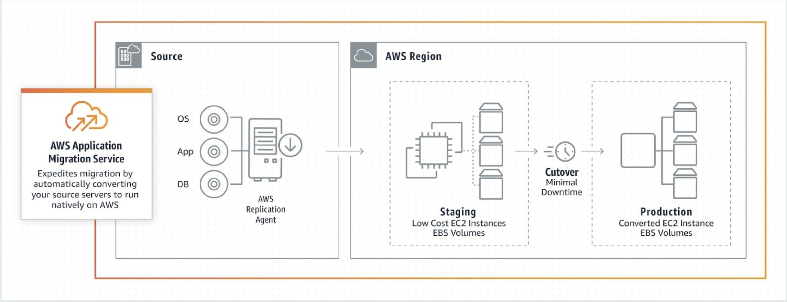
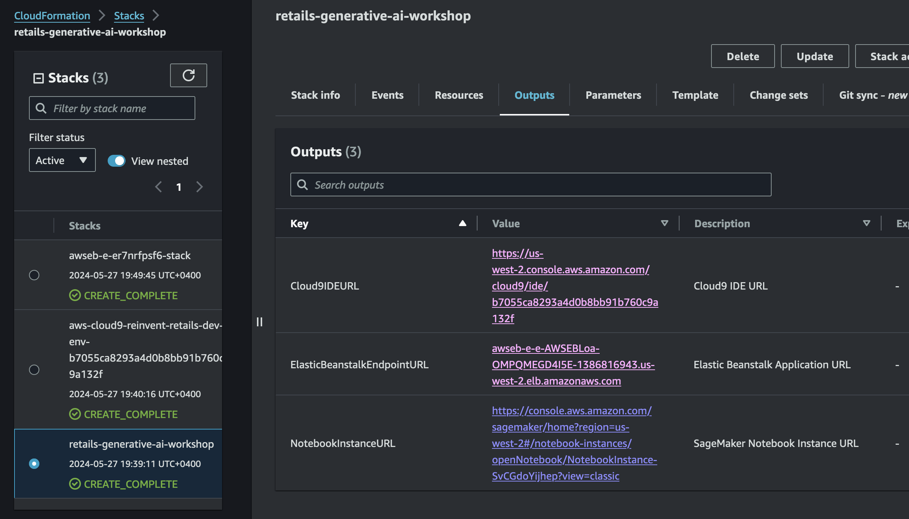

## Configure AWS MGN for migrating your workloads from one AWS Region to another.

Moving to the cloud can be tough for companies as they need to ensure smooth and safe data transfers. [AWS MGN](https://aws.amazon.com/application-migration-service/), a service by Amazon Web Services, makes this easier. It helps companies to **Lift** and **Shift** their data to AWS securely, cutting downtime and lowering the chance of losing data.

Lift-and-shit consists in copying the existing applications and data to the cloud with no redesigning or modification, it’s a copy paste operation.

### MGN Big picture 

1. In order to perform a migration using AWS MGN, we need to install the AWS MGN Replication Agent on our source (machine that we intend to migrate). 
2. Replication servers copy the data from your source servers using the AWS Replication Agent. 
3. The data are written in the EBS volume in a compressed and encrypted format. 
4. When performing a cutover, AWS uses your defined launch settings to launch the instances. 
5. After confirming that your launched instances are operating properly on AWS, you can decommission your source servers.

### Get Started

#### Provision of a source server to be copied

- Launch an Ec2 instance with public IP enabled and inbound 22 (SSH) and 80 (HTTP) open in any region of your choice. This will be the source server and region (eu-west-1).

- Install Apache

  

- Start the HTTPD service

  

- Go to the web browser and copy paste the instance public IP.
  
  

#### Initialize AWS Application Migration Service (MGN) 

- Select on AWS Console the service **Application Migration Service**. The service must be initialized in any AWS region you plan to use and copy the source server over your target region. 
- AWS credentials will be needed to install the Replication Agent on the source server.