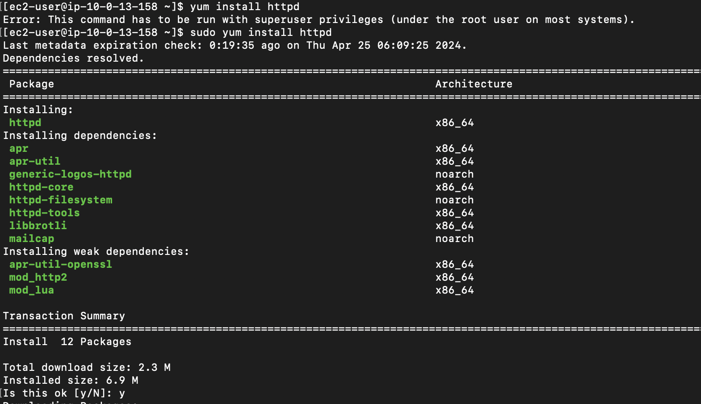
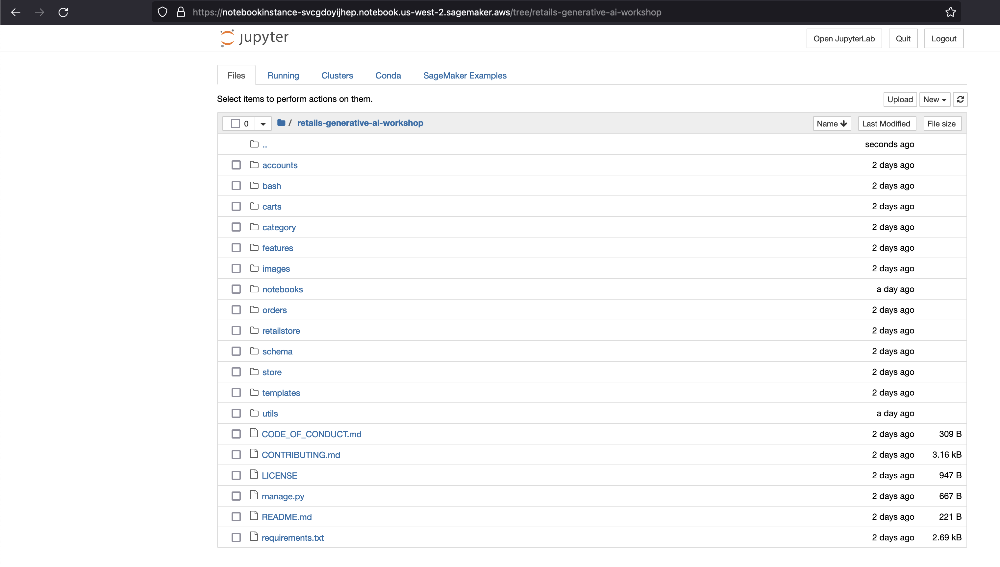
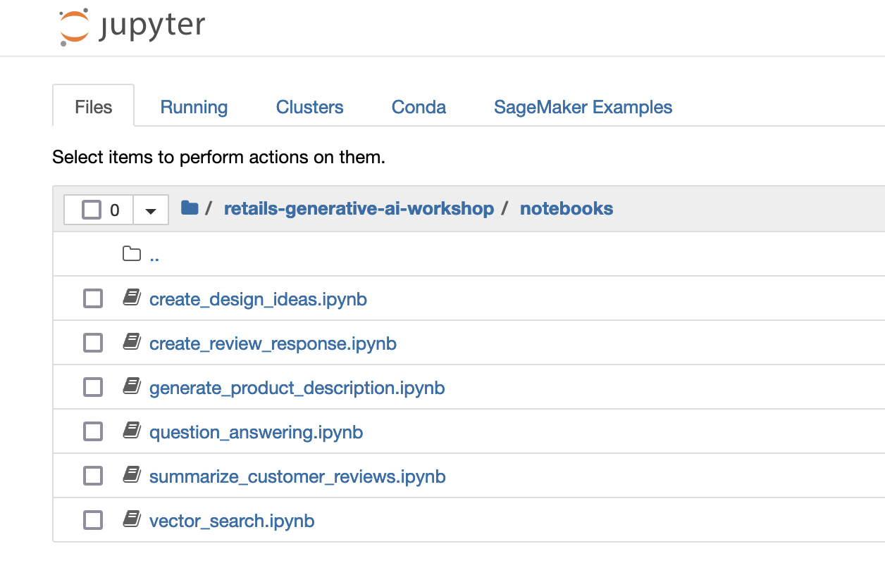
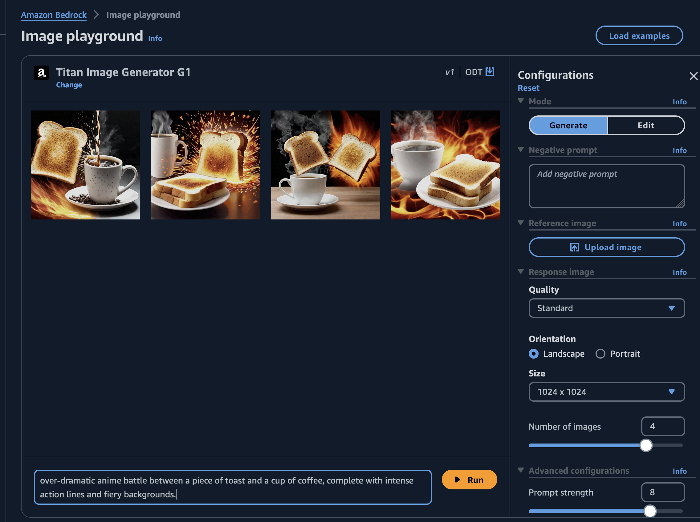

# Introduction 

Just a few days back, I jumped into this online workshop hosted by AWS. They were all about using Generative AI to build smart apps. It was called 'Build Intelligent Enterprise Apps Powered By Generative AI On AWS - GenAI Booster.' Participants were given access to a temporary AWS account, valid for 48 hours, specifically for the workshop. This account provided hands-on experience and access to the necessary resources for the duration of the event.

## Service Used 

1. [Amazon Bedrock](https://aws.amazon.com/bedrock/) - fully managed service that provides the easiest way to build and scale generative AI applications with foundation models, with a single API, along with a broad set of capabilities you need to build generative AI applications.
2. [Aws Cloud9](https://aws.amazon.com/cloud9/) - Cloud-based integrated development environment (IDE) that lets you write, run, and debug your code with just a browser. In this workshop, we use Cloud9 IDE to build and deploy the generative AI features into our retail website.
3. [Amazon Elastic Beanstalk](https://aws.amazon.com/elasticbeanstalk/) - Used for deploying and scaling web applications developed with popular programming languages such as Java, Javascript, Python, etc., and frameworks such as Django, Springboot, Ruby on Rails etc. Elastic Beanstalk comes with features like automatic scaling, load balancing, and monitoring capabilities.
4. [Amazon Sagemaker Notebooks ](https://aws.amazon.com/sagemaker/notebooks/) - Fully managed Jupyter based notebook interface. 
5. [Amazon Relational Database Service ](https://aws.amazon.com/rds/) - RDS - Managed database service that makes it easy to set up, operate, and scale relational databases in the cloud.

## Few Core Concepts

1. [Large Language Models](https://aws.amazon.com/what-is/large-language-model/) - or LLMs are very large deep learning models that are pre-trained on vast amounts of data. You can use LLMs for variety of use cases like Knowledge base answering, Text classification, Code generation etc.
2. [LangChain](https://python.langchain.com/docs/get_started/introduction) - is an opensource framework used for developing applications powered by LLMs. LangChain provides many libraries, APIs and templates to make it easy for us to develop applications powered by LLMs. [LangChain integrates with Bedrock](https://python.langchain.com/docs/integrations/llms/bedrock), and can be used to invoke the Bedrock APIs. 
3. Prompt -  natural language text that describes the task that an LLM should perform. For example, you may prompt the LLM: Describe microbiomes or What is the abstract of this white paper?. You can use prompts to do various tasks with LLM such as Text Generation, Text Summarization, Sentiment Analysis, Classification etc. [Prompt engineering](https://en.wikipedia.org/wiki/Prompt_engineering) is the art of writing generative AI prompts. 

## Getting Started

We were also provided with a CloudFormation stack to build the Retail Web Application. All we needed to do was run the CloudFormation stack and ensure that the web app was working.

After launching the "retails-generative-ai-workshop", the web app and all other resources will be created.

### Retail Web Application. 
This application is running on Amazon Elastic Beanstalk.

### Cloud9 Development Environment

### Sagemaker Jupyter Notebooks

## Amazon Bedrock Model access

Access to Amazon Bedrock foundation models isn't granted by default. In order to gain access to a foundation model, an IAM user with sufficient permissions needs to request access to it through the console. Once access is provided to a model, it is available for all users in the account.

The model access is available at the bottom of the left navigation pane in the Amazon Bedrock management console.

### Playing around with the Image generation

### Text Generation

P.s My dad's name is Rajesh 😂