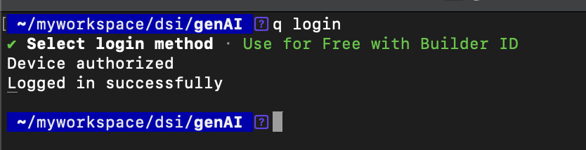
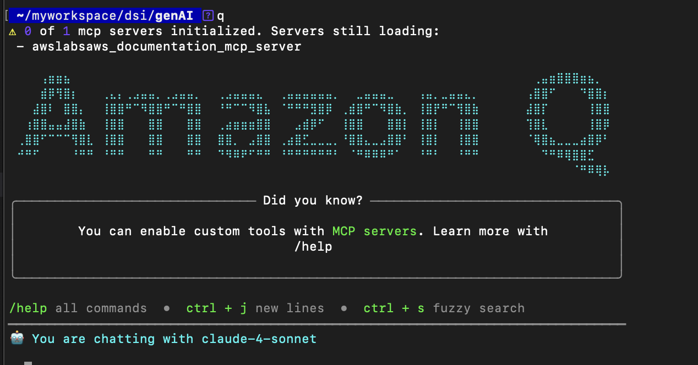
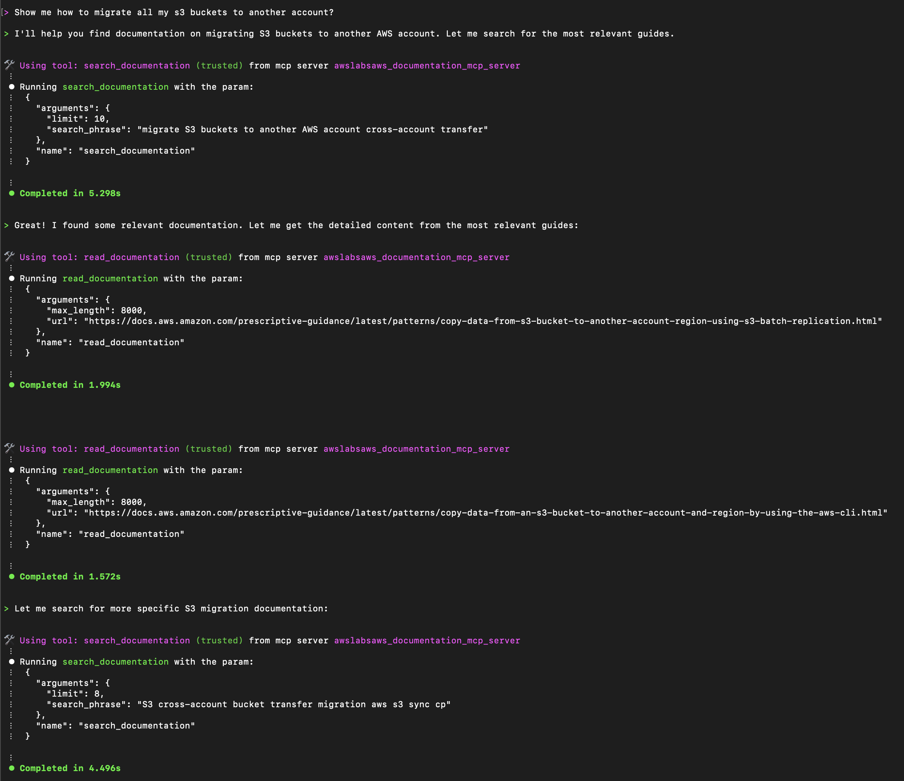
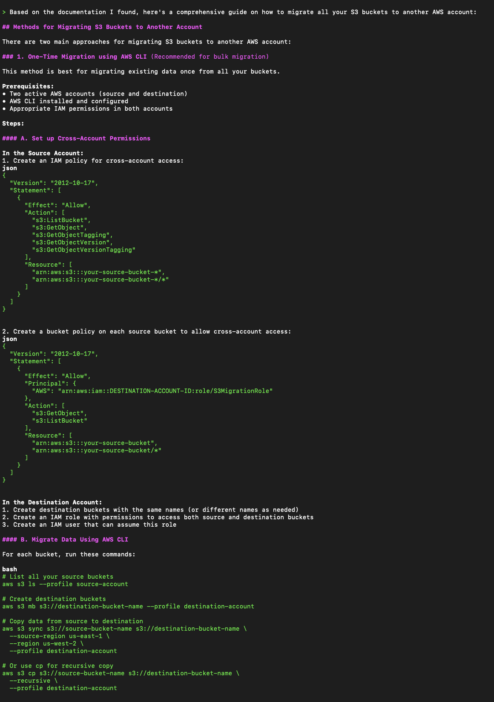
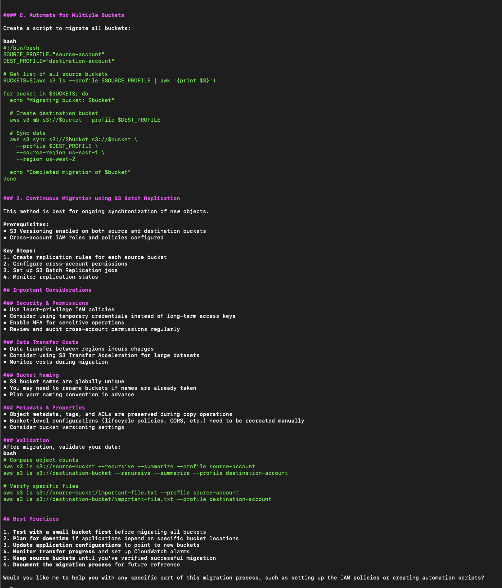

Okay, so you might be wondering, what the heck is **Amzon Q**, and what is **MCP**? 
Dont worry, I was just confused at first!

So, we recently had a meeting with our AWS guru the other day, and introduced to us **Amazon Q** and **MCP**.

Let me give you a quick intro to both.

## Amazon Q
You have probably noticed that small blue icon when you visit the AWS docs. yes yes, that's **Amazon Q**

Basically, it's AWS's new Gen AI assitant that helps you understand AWS Services. You can ask it questions, and it will answer all the bla-bla-bla. But did you know that you can also use it from your terminal? Well... yep you can.


## MCP

Short for **Model Context Protocol**.

Think of it as the magic connector behind the scenes that makes Amazon Q smarter. Like a phone that lets Q call up tools, such as your AWS account, to get info it doesn't already know. Using the **Amazon Q CLI**, you can type something like:  
*"How do I create an EC2 instance?"*  And MCP links Q to a server that fetches the answer.

P.S. It can also generate code. 😎


## Installing Amazon Q for command line

The installation is rather simple. You can just follow the [official documentation](https://docs.aws.amazon.com/amazonq/latest/qdeveloper-ug/command-line-installing.html)


I am using the Basic Tier, since...i'm poor 😭

To login, just type 

```
q login
```

It will log you into your account and ask your permission to use Amazon Q.




Before we start interacting with Q, we must add the MCP Servers. Head over to the [aws labs github repos](https://github.com/awslabs/mcp/tree/main/src/aws-documentation-mcp-server).

Notice that in the Prerequisites, you will need to install uv from [Astral](https://docs.astral.sh/uv/getting-started/installation/) and also Python 3.10 or newer.

Add the json code in `~/.aws/amazonq/mcp.json `

```
{
  "mcpServers": {
    "awslabs.aws-documentation-mcp-server": {
      "command": "uvx",
      "args": ["awslabs.aws-documentation-mcp-server@latest"],
      "env": {
        "FASTMCP_LOG_LEVEL": "ERROR",
        "AWS_DOCUMENTATION_PARTITION": "aws"
      },
      "disabled": false,
      "autoApprove": []
    }
  }
}
```

Once done, type `q` to your terminal.



Bravo, you have successfully added Amazon Q to your terminal.

Now for the not so magic part, chat with it.


# Chatting with Amazon Q

To test if it works, I asked how to migrate all s3 buckets to another account?

From the screenshot, you can see that it is using the mcp server that we added earlier awslabsaws_documentation_mcp_server to do the reasearch.



Now, It's showing how to migrate the s3 buckets including the IAM policy and the buckey policy to add.




Here, it is giving some important considerations and Best Practices.



And there you have it. 

I'll do something even cooler 👀 