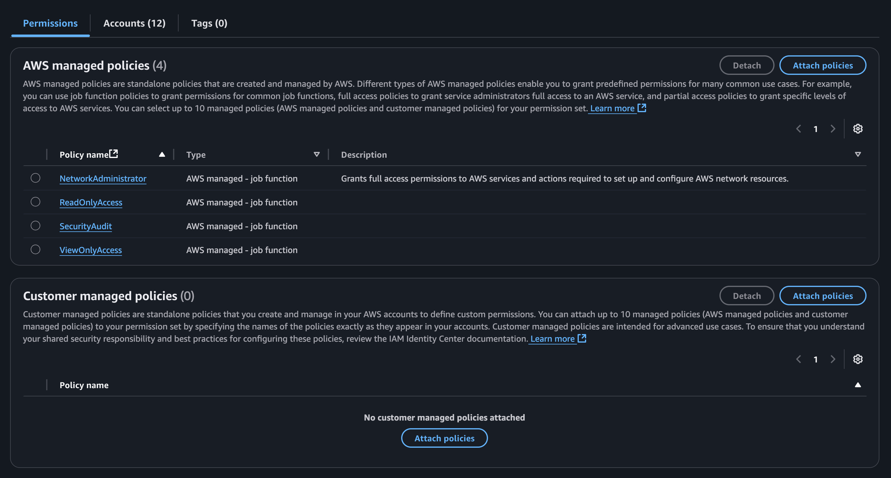
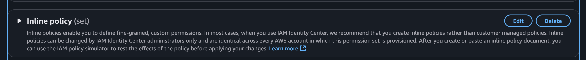

# Intro 

Ever wondered how you can give a particular user or group specific permissions on one or multiple AWS accounts?

Well, with AWS IAM Identity Center, you can achieve this by creating Permission Sets and assigning them to users or groups for specific AWS accounts.
# Steps to Achieve This

1. On your payer account, go to **IAM Identity Center**
2. Navigate to **Permission Set**, then create one or update an existing one.
3. You’ll notice that you can attach either AWS managed policies or customer-managed policies.

1. Since we are interested in giving specific permission to specific role, scroll down to **Inline policy (set)** and edit.

1. Here, you can add your custom inline policy, for example :

```
{
	"Version": "2012-10-17",
	"Statement": [
		{
			"Sid": "startstopEC2",
			"Effect": "Allow",
			"Action": [
				"ec2:StopInstances",
				"ec2:StartInstances"
			],
			"Resource": [
				"arn:aws:ec2:eu-west-1:<Account-id>:instance/<instance-id>",
			]
		},
		{
			"Sid": "AttachDetachOnlyApprovedManagedPoliciesOnRole",
			"Effect": "Allow",
			"Action": [
				"iam:AttachRolePolicy",
				"iam:DetachRolePolicy"
			],
			"Resource": "arn:aws:iam::<Account-id>:role/<Role-name>",
			"Condition": {
				"StringLike": {
					"iam:PolicyARN": "arn:aws:iam::aws:policy/*"
				}
			}
		},
		{
			"Sid": "CreateOrDeleteInlinePoliciesOnRole",
			"Effect": "Allow",
			"Action": [
			    "iam:PutRolePolicy",
			    "iam:DeleteRolePolicy"
			],
			"Resource": "arn:aws:iam::<Account-id>:role/<Role-name>"
		}
	]
}
```

Basically, the above policy allows you to
   - Start and stop <instance-id> in the account <Account-id>.
   - Attach and detach Policy for the Role <Role-name> in the account <Account-id>.
   - Create and Delete Inline Policy for the role <Role-name>.

1. Save the inline policy and create the permission set.


# Testing

To test, go to your Account <Account-id>, and try updating your role, You should now have the permissions to perform these actions successfully.


