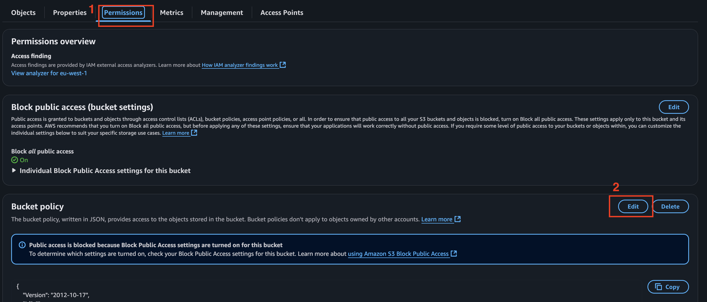

# AWS S3 Cross-Account Replication

Say for X reason, you need to migrate all your data from an S3 bucket in **Account A** to a bucket in **Account B**. There are several ways to go about it. For example:

1. **The Manual Way** 
   
   Download all the objects from the source bucket in Account A to your local machine, then upload them to the destination bucket in Account B.
Is it the smartest way? Probably not. But technically, it works.

2. **Lambda function**

   Automate the migration that reads objects from the source bucket and copies them to the target bucket.

3. **CloudShell**

   If you're not into setting up Lambda functions or writing much code, AWS CloudShell is a great option. It’s a browser-based terminal that comes with the AWS CLI pre-installed and runs directly in your AWS environment, no need to install anything locally.

``` 
aws s3 cp s3://source-bucket-name s3://destination-bucket-name --recursive 
```
Of course, you’ll need to configure cross-account access properly — either by assuming a role in the source account or by granting the right permissions to your credentials in CloudShell.

4. Via **Amazon EFS**, Mount EFS to EC2 instances in both accounts to transfer data between S3 buckets.

Okay, so those were the more “manual” or basic methods to handle S3 migration. Now, let’s get into how AWS can help us migrate S3 much more efficiently and effortlessly.

5. **S3 Cross-Region & Cross-Account Replication**

   Automatically replicates new and updated objects from one bucket to another—across accounts or regions. This is what i'll show in details in this blog.

6. **S3 Batch Operations**

    Allows you to perform large-scale batch operations on millions of objects, like copying or tagging. It’s perfect for one-time bulk migrations or changes without building your own scripts.

7. **AWS DataSync**

    A fully managed service to transfer large amounts of data between S3 buckets, on-premises storage, or other AWS services. It’s fast, efficient, and supports incremental transfers with built-in validation.

## S3 Cross-Account Replication

I chose this method because of its continuous backup capability. Imagine you’ve migrated all your existing data from the old bucket to the new one, but new objects are still being uploaded to the old bucket. This is why S3 Cross-Account Replication is the best option, it automatically replicates any new objects to Account B, keeping both buckets in sync without any extra effort.

Below is the provided Architecture from the [AWS documentation](https://docs.aws.amazon.com/prescriptive-guidance/latest/patterns/copy-data-from-s3-bucket-to-another-account-region-using-s3-batch-replication.html)


**Step 1: Create a Replication Rule in the Source Account**

**NOTE :** Make sure to enable **Versioning** on both your source and destination S3 buckets.

1. Go to your **Source Account**, select your **S3 Bucket** you want to migrate, and open the **Management** tab.
2. Create a **replication rule** with the following configuration:


- The above configuration simply means you're selecting all objects in the bucket to be replicated to the destination S3 bucket.
- The **"Change object ownership to destination bucket owner"** option ensures that ownership of the replicated objects is transferred to the destination account, giving it full control.

- As for the role, I selected **"Create new role"**. You can also create the IAM role manually and then choose **"Use existing role"**. : 

**Trust relationship**: 

```
{
    "Version": "2012-10-17",
    "Statement": [
        {
            "Effect": "Allow",
            "Principal": {
                "Service": [
                    "batchoperations.s3.amazonaws.com",
                    "s3.amazonaws.com"
                ]
            },
            "Action": "sts:AssumeRole"
        }
    ]
}
```

**Permissions for AWS IAM Role** :

```
{
    "Version": "2012-10-17",
    "Statement": [
        {
            "Sid": "GetSourceBucketConfiguration",
            "Effect": "Allow",
            "Action": [
                "s3:ListBucket",
                "s3:GetBucketLocation",
                "s3:GetBucketAcl",
                "s3:GetReplicationConfiguration",
                "s3:GetObjectVersionForReplication",
                "s3:GetObjectVersionAcl",
                "s3:GetObjectVersionTagging"
            ],
            "Resource": [
                "arn:aws:s3:::source-bucket-name",
                "arn:aws:s3:::source-bucket-name/*"
            ]
        },
        {
            "Sid": "ReplicateToDestinationBuckets",
            "Effect": "Allow",
            "Action": [
                "s3:List*",
                "s3:*Object",
                "s3:ReplicateObject",
                "s3:ReplicateDelete",
                "s3:ReplicateTags"
            ],
            "Resource": [
                "arn:aws:s3:::destination-bucket-name*",
                "arn:aws:s3:::destination-bucket-name/*"
            ]
        },
        {
            "Sid": "PermissionToOverrideBucketOwner",
            "Effect": "Allow",
            "Action": [
                "s3:ObjectOwnerOverrideToBucketOwner"
            ],
            "Resource": [
                "arn:aws:s3:::destination-bucket-name*",
                "arn:aws:s3:::destination-bucket-name/*"
            ]
        }
    ]
}
```

**Note**: Be sure to replace `source-bucket-name` and `destination-bucket-name` with your actual bucket names.


## Step 2: Apply a Bucket Policy to the Destination Bucket
Okay, so far we are done with the configuration in the Source Account, now lets add the bucket policy in the destination account.

1. Go to your Destination S3 bucket and on the choose the **Permissions** tab.
2. Edit the Bucket Policy.
   



3. Copy and Paste the below policy in the field.

```
{
    "Version": "2012-10-17",
    "Id": "PolicyForDestinationBucket",
    "Statement": [
        {
            "Sid": "Permissions on objects and buckets",
            "Effect": "Allow",
            "Principal": {
                "AWS": "arn:aws:iam::SourceAWSAccountNumber:role/IAM-Role-created-in-step1-in-source-account"
            },
            "Action": [
                "s3:List*",
                "s3:GetBucketVersioning",
                "s3:PutBucketVersioning",
                "s3:ReplicateDelete",
                "s3:ReplicateObject"
            ],
            "Resource": [
                "arn:aws:s3:::destination-bucket",
                "arn:aws:s3:::destination-bucket/*"
            ]
        },
        {
            "Sid": "Permission to override bucket owner",
            "Effect": "Allow",
            "Principal": {
                "AWS": "arn:aws:iam::SourceAWSAccountNumber:role/IAM-Role-created-in-step1-in-source-account"
            },
            "Action": "s3:ObjectOwnerOverrideToBucketOwner",
            "Resource": "arn:aws:s3:::destination-bucket/*"
        }
    ]
}
```

**Note**:  
- Replace the **SourceAWSAccountNumber** with the Source Account ID.
- Replace **IAM-Role-created-in-source-account** with the Role that was created above by the Replication rule.
- Replace **destination-bucket** with the Name of the Destination Bucket.


## Step 3 : Run Batch Operation Jobs

Now, since we are done with all the configuration, all need to be done, is to run the replcation.

1. Go to your **Source Account** and **S3 bucket** and choose **Batch Operations**. And Create a **Job**.


2. Keep everything as default. Choose a bucket where you want to store the Manifest file.


1. For **Operation**, choose **Replicate**, since we are replicating the S3.

2. And for **Configure addtional option**, you can choose to get a Completion Report, where you will get a report of all tasks including failed tasks, Or you can choose not to get the Report.
3. As for the permission, you can **Choose from existing IAM roles**

4. Review the Job and Run it.
   


5. Once the Job has completed, you will be able to see if it has been completed as Success or Failure.


## Step 4: Verify data on Destination Bucket.

Go to your Destination Bucket, and you will see all your data has been updated it.


## Step 5 : Add new object to Source Bucket.

Now to test the continuous Backup capability, upload an object on your Source Bucket and verify on your Destination bucket, you will be able to see that the new object will also be uploaded on the destination bucket.


# Conclusion  :

Hope you got a clear idea how AWS S3 handles the replication.

# References :

https://docs.aws.amazon.com/prescriptive-guidance/latest/patterns/copy-data-from-s3-bucket-to-another-account-region-using-s3-batch-replication.html